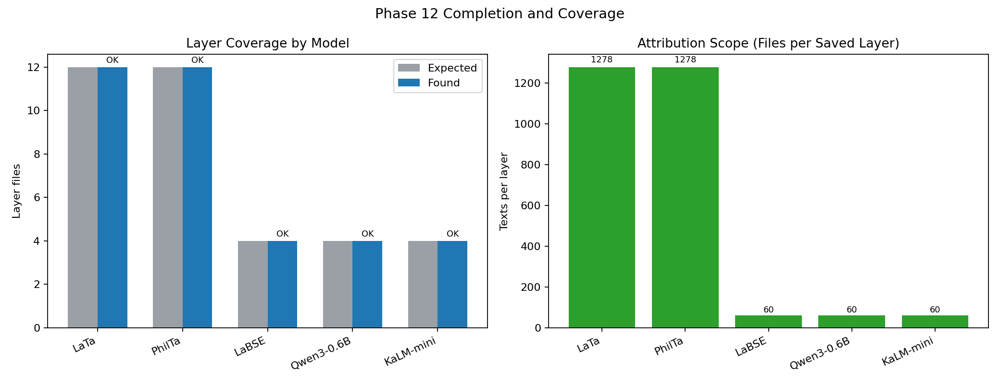
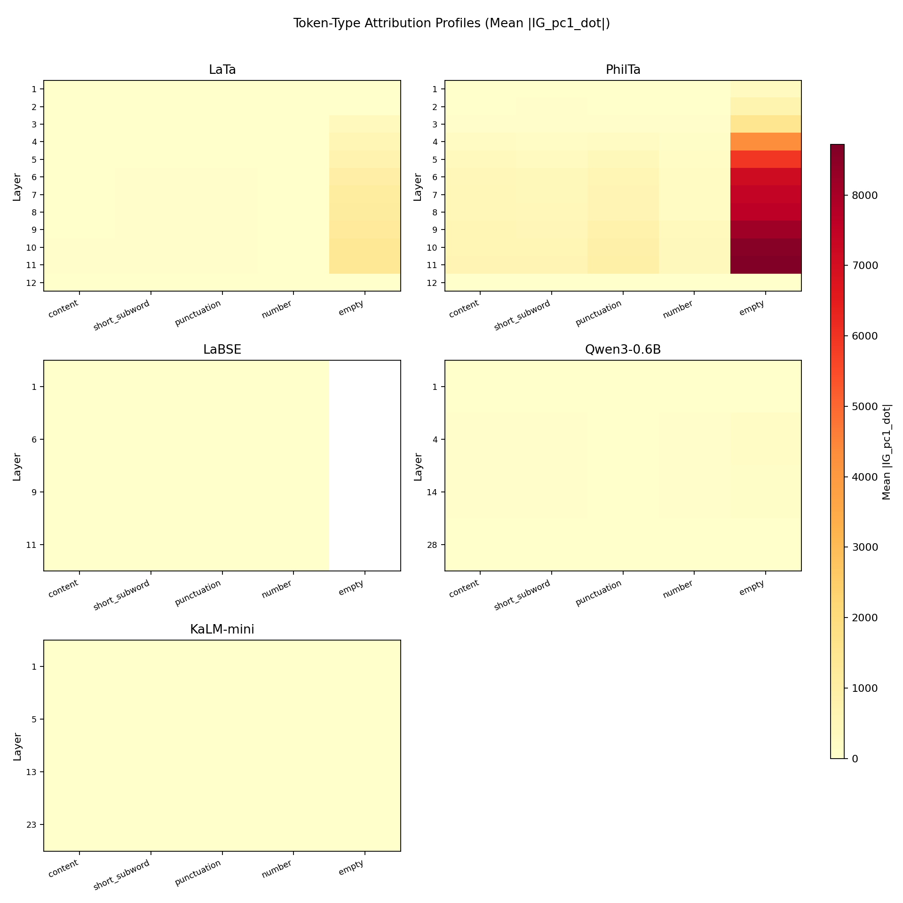
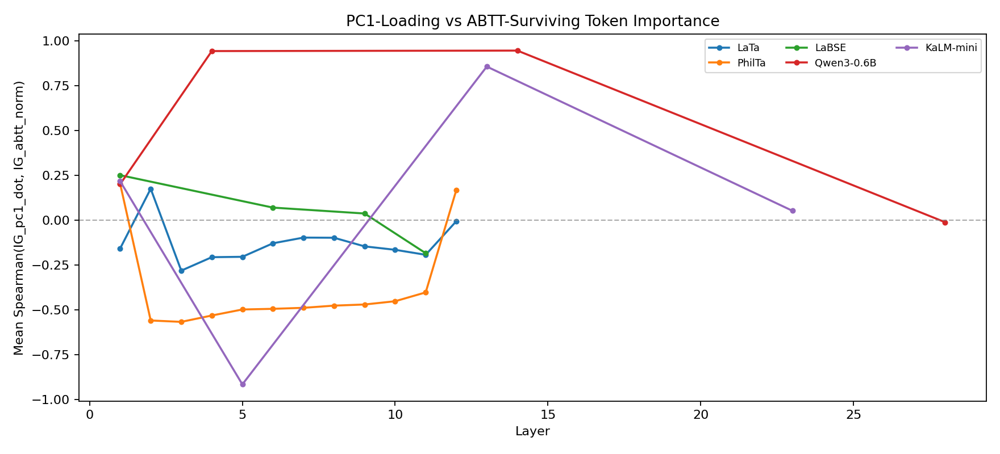
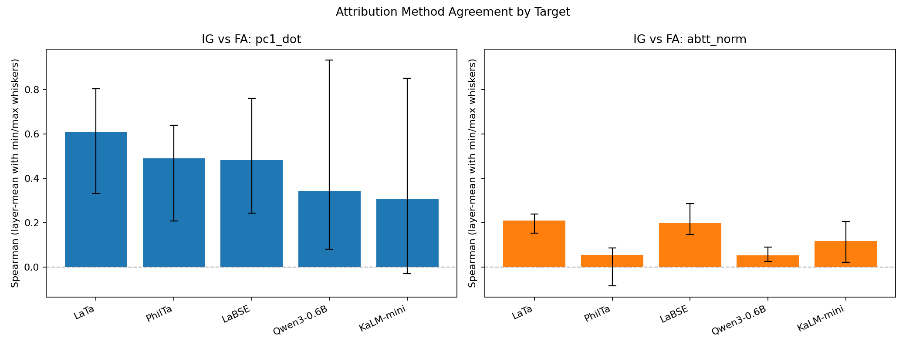
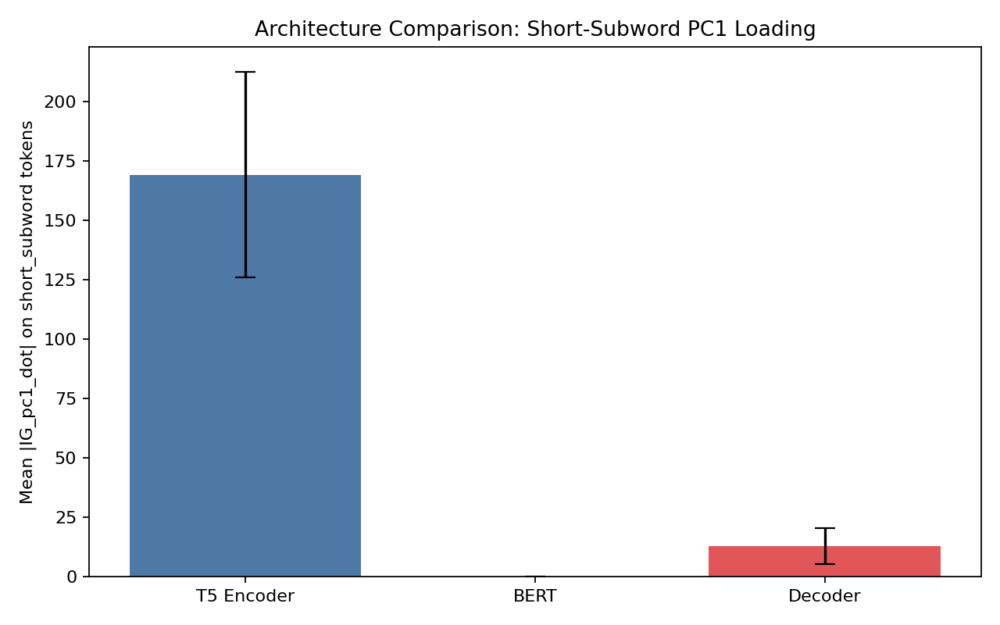
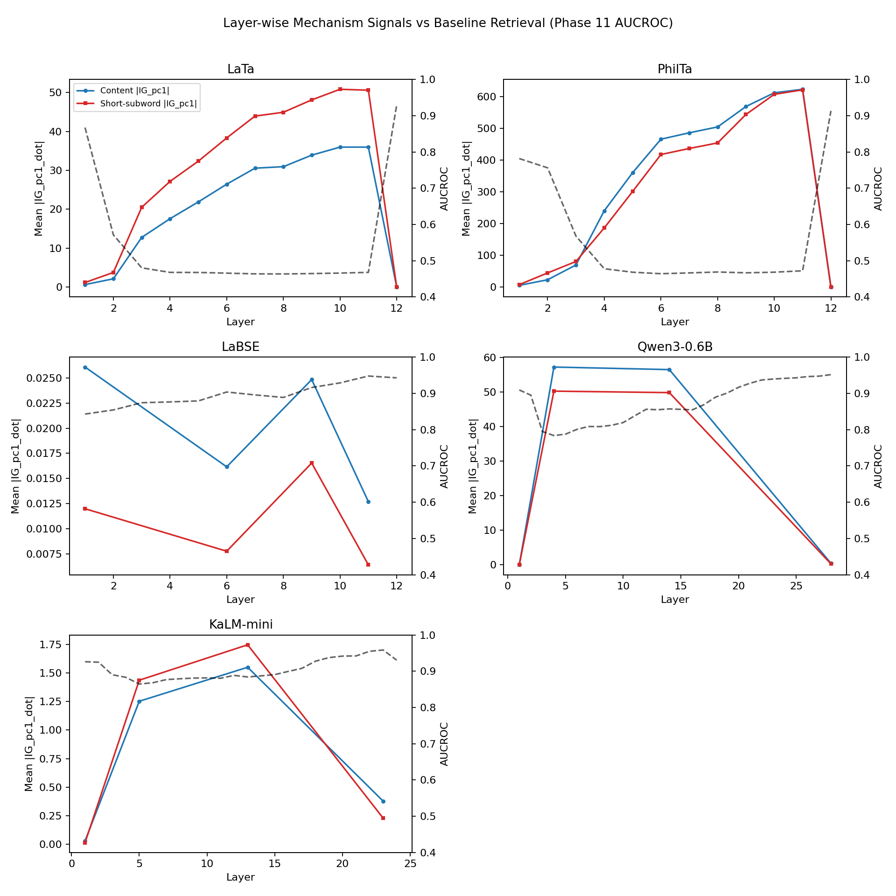

# Phase 12: Captum Token-Level Attribution Analysis (CS Undergrad-Friendly)

## 1. Direct Answers to Your Two Main Questions

### Q1) Is this helping bring ABTT out of the black box?
Yes, **partially and meaningfully**.

What we can now show:
1. At token level, we can measure which tokens push embeddings toward PC1 (`pc1_dot`) and which tokens still matter after ABTT (`abtt_norm`).
  - `pc1_dot` asks: “How much is this text pushed into the dominant (possibly noisy) direction?”
  - `abtt_norm` asks: “After removing dominant directions, how much useful signal is left?”
2. In T5 models (LaTa/PhilTa), these signals are often opposite in dip layers (negative correlation), which is evidence that ABTT is removing a specific bad direction.
3. In decoder models (Qwen/KaLM), behavior changes by layer (sometimes same-direction, sometimes opposite), so mechanism is not one universal story.

Bottom line:
1. ABTT is no longer a total black box.
2. But the explanation is **architecture-conditional**, not one rule for all models.

### Q2) Can we show that this token behavior is what makes AUCROC go up?
We can show a **strong link**, but not a full formal proof of causality.

What we directly measured:
1. Token attributions for PC1 and ABTT-norm targets.
2. Layer-level correlation patterns from those attributions.
3. Layerwise alignment with baseline AUCROC curves from Phase 11.

What we did **not** directly optimize in Captum:
1. AUCROC itself (AUCROC is dataset-level retrieval metric, not a single-sample scalar target in this Phase 12 setup).

So the safest claim is:
1. Phase 12 provides token-level mechanism evidence that is consistent with Phase 11 AUCROC improvements.
2. It is a mechanistic explanation layer, not a direct AUCROC gradient decomposition.

---

## 2. Quick Graph Reading Guide (Very Simple)

Use this for every figure:
1. X-axis usually means **layer number** (where we are inside the model).
2. Y-axis means **some score** (correlation, attribution strength, or AUCROC).
3. If a line goes below 0 in correlation plots, it means "tokens important for one target are less important for the other target."
4. If two lines move together, they are aligned; if they move opposite, they are in tension.
5. In heatmaps, brighter color means "larger value" for that cell.

---

## 3. Data Scope and Completion (What was actually run)

All Phase 12 jobs finished successfully (final completion: February 26, 2026).



Source tables:
1. `runs/phase12/report_assets/table01_dataset_and_run_scope.csv`
2. `runs/phase12/phase12_samples.csv`

Key scope facts:
1. 60 sampled files: 30 similar + 30 dissimilar.
2. Sample split: 18 train / 42 test.
3. LaTa and PhilTa: 12 layers each, 1278 files per layer.
4. LaBSE, Qwen3-0.6B, KaLM-mini: 4 selected layers each, 60 files per layer.

Simple explanation:
1. The experiment is complete and large enough to discuss mechanism patterns.
2. T5 models have much more data per layer, so their trend estimates are more stable.

---

## 4. Step-by-Step Results

### Step 1: Token-Type Profiles

Question:
Do different token types carry different anisotropy-related attribution?



How to read this graph:
1. Each panel is one model.
2. Rows are layers.
3. Columns are token categories (`content`, `short_subword`, etc.).
4. Brighter cell = stronger mean `|IG_pc1_dot|` for that category/layer.

Technical interpretation:
1. Token-type attribution patterns change across layers in all models.
2. T5 patterns are more structured than decoder patterns.
3. This supports architecture-conditional mechanism analysis.

Simple explanation:
1. The model does not treat all token types equally at every depth.
2. Which tokens look "important" changes as information flows through layers.
3. This already tells us ABTT probably fixes different things in different models.

Related PDFs:
1. `runs/phase12/figures/fig_token_profile_bowphs_LaTa.pdf`
2. `runs/phase12/figures/fig_token_profile_bowphs_PhilTa.pdf`
3. `runs/phase12/figures/fig_token_profile_sentence-transformers_LaBSE.pdf`
4. `runs/phase12/figures/fig_token_profile_Qwen_Qwen3-Embedding-0.6B.pdf`
5. `runs/phase12/figures/fig_token_profile_KaLM-Embedding_KaLM-embedding-multilingual-mini-instruct-v2.5.pdf`

---

### Step 2: PC1-vs-ABTT Correlation by Layer

Question:
Are the tokens that push toward PC1 the same tokens that survive ABTT, or opposite tokens?



How to read this graph:
1. Y-axis is Spearman correlation between token attributions for `pc1_dot` and `abtt_norm`.
2. Below 0 means "opposite ranking" (tokens high for one tend to be low for the other).
3. Above 0 means "similar ranking" (same tokens tend to score high on both).

Source tables:
1. `runs/phase12/report_assets/table02_pc1_abtt_key_stats.csv`
2. `runs/phase12/figures/stats_pc1_vs_abtt.csv`

Key numbers:
1. LaTa mean = `-0.126`; 11/12 layers negative.
2. PhilTa mean = `-0.381`; 10/12 layers negative.
3. LaBSE mean = `+0.043`; mixed sign.
4. Qwen mean = `+0.519`; strongly positive in middle selected layers.
5. KaLM mean = `+0.053`; strong sign flip by layer.

Technical interpretation:
1. T5 dip layers strongly support an "ABTT removes PC1-heavy signal" mechanism.
2. Decoder behavior is mixed; no universal anti-correlation claim is valid.

Simple explanation:
1. In T5, the tokens that create the bad PC1 direction are often **not** the tokens ABTT keeps.
2. In decoders, many times ABTT and PC1 still focus on similar tokens.
3. So ABTT helps all models in retrieval, but the internal token reason differs.

---

### Step 3: IG-vs-FA Agreement (Reliability)

Question:
Can we trust the token attribution signals?



How to read this graph:
1. Left panel is `pc1_dot`, right panel is `abtt_norm`.
2. Taller bar means stronger average agreement between IG and FA.
3. Error bars show layer variation.

Source tables:
1. `runs/phase12/report_assets/table03_ig_fa_summary.csv`
2. `runs/phase12/figures/stats_ig_fa_agreement.csv`

Key numbers:
1. `pc1_dot` mean agreement: LaTa `0.606`, PhilTa `0.490`, LaBSE `0.483`, Qwen `0.343`, KaLM `0.306`.
2. `abtt_norm` mean agreement: LaTa `0.210`, PhilTa `0.055`, LaBSE `0.200`, Qwen `0.052`, KaLM `0.117`.

Technical interpretation:
1. PC1-target explanations are the more reliable mechanism channel.
2. ABTT-norm interpretation should be cautious.

Simple explanation:
1. Two different explanation tools mostly agree for PC1, so that story is fairly stable.
2. They agree much less for ABTT-norm, so that part is less certain.

---

### Step 4: Architecture Comparison (Short Subwords)

Question:
Do architectures differ in how much short token pieces load onto PC1?



How to read this graph:
1. Each bar is an architecture group (T5/BERT/Decoder).
2. Higher bar means stronger short-subword PC1 loading on average.

Technical interpretation:
1. There are architecture-level differences in short-subword loading.
2. This aligns with model-specific correlation behavior from Step 2.

Simple explanation:
1. Different model families break words differently and use those pieces differently.
2. That is one reason a single universal token-mechanism explanation fails.

---

### Step 5: Layerwise Mechanism vs Baseline Retrieval AUCROC

Question:
Do mechanism curves line up with retrieval collapse/recovery patterns?



How to read this graph:
1. Blue/red lines are token-attribution summaries by layer.
2. Dashed black line is baseline AUCROC from Phase 11.
3. We look for whether changes in token mechanism co-occur with dip/recovery regions.

Phase 11 source:
1. `runs/phase11/phase11_results.csv` (`method=baseline`, `repr=hidden`, `aucroc`)

Technical interpretation:
1. T5 models show clearer alignment between dip region and strong mechanism signals.
2. Decoder models show mixed alignment with sign changes.

Simple explanation:
1. In T5, the token-level explanation tracks the same layers where retrieval was broken.
2. In decoders, retrieval improves with ABTT too, but token-level path is not one clean pattern.

Related PDFs:
1. `runs/phase12/figures/fig_layerwise_bowphs_LaTa.pdf`
2. `runs/phase12/figures/fig_layerwise_bowphs_PhilTa.pdf`
3. `runs/phase12/figures/fig_layerwise_sentence-transformers_LaBSE.pdf`
4. `runs/phase12/figures/fig_layerwise_Qwen_Qwen3-Embedding-0.6B.pdf`
5. `runs/phase12/figures/fig_layerwise_KaLM-Embedding_KaLM-embedding-multilingual-mini-instruct-v2.5.pdf`

---

## 5. Token-Level Granularity (Concrete Examples)

This section is the "not black-box" evidence at token granularity.

Important note:
1. Many tokens are subword pieces, not clean full words, because tokenizer vocab splits words.
2. This is expected in transformer pipelines.

Source tables:
1. `runs/phase12/report_assets/table05_token_level_top_tokens.csv`
2. `runs/phase12/report_assets/table06_token_level_category_summary.csv`
3. `runs/phase12/report_assets/table07_token_overlap_pc1_vs_abtt.csv`

### 5.1 Top tokens at focus layer (worst baseline AUC layer per model)

| Model | Focus layer | Top `pc1_dot` tokens (first 3) | Top `abtt_norm` tokens (first 3) |
|---|---:|---|---|
| LaTa | 8 | `singul`, `gradib`, `insidiatur` | `nulli`, `singul`, `insidiatur` |
| PhilTa | 6 | `fractus`, `evangelium`, `celebritate` | `amissi`, `iniquitatis`, `detenti` |
| LaBSE | 1 | `duobus`, `desidera`, `accipere` | `desidera`, `Pae`, `duobus` |
| Qwen3-0.6B | 4 | `NIC`, `innoc`, `TEM` | `NIC`, `innoc`, `TEM` |
| KaLM-mini | 5 | `au`, `ister`, `iser` | `au`, `ister`, `iser` |

Simple explanation:
1. T5 examples often change more between PC1 and ABTT token lists.
2. Qwen/KaLM examples overlap a lot more in these focus layers.

### 5.2 Token-set overlap between `pc1_dot` and `abtt_norm`

| Model | Overlap (Jaccard) | Meaning |
|---|---:|---|
| LaTa | 0.200 | Mostly different token sets |
| PhilTa | 0.043 | Very different token sets |
| LaBSE | 0.091 | Mostly different token sets |
| Qwen3-0.6B | 0.846 | Largely same token sets |
| KaLM-mini | 0.714 | Largely same token sets |

Simple explanation:
1. This is a clear, concrete signal that T5 and decoder models behave differently internally.
2. It supports the claim that ABTT's token-level mechanism differs by architecture.

---

## 6. What This Means for the Paper

### What we can claim strongly
1. ABTT is a robust retrieval improvement method across architectures (Phase 11 result).
2. Phase 12 adds token-level evidence explaining part of this effect.
3. The clearest mechanism signal appears in T5 dip layers.

### What we should claim carefully
1. Token-level mechanism is architecture-conditional.
2. PC1-target evidence is stronger than ABTT-norm evidence.
3. We should avoid claiming one universal token explanation.

Claim guardrails source:
1. `runs/phase12/report_assets/table04_claim_guardrails.csv`

Simple explanation:
1. We can now explain ABTT better than before.
2. But we should present it as a family of mechanisms, not one mechanism.

---

## 7. Best Figures for Main Paper

Recommended main-text figures:
1. `runs/phase12/report_assets/fig02_pc1_vs_abtt_by_layer.png`
2. `runs/phase12/report_assets/fig06_layerwise_mechanism_vs_auc.png`
3. `runs/phase12/report_assets/fig03_ig_fa_agreement_targets.png`
4. `runs/phase12/report_assets/fig04_token_profile_selected_models.png`

Recommended supplementary:
1. `runs/phase12/report_assets/fig01_phase12_completion_and_coverage.png`
2. `runs/phase12/report_assets/fig05_architecture_short_subword_loading.png`
3. `runs/phase12/report_assets/table05_token_level_top_tokens.csv`
4. `runs/phase12/report_assets/table07_token_overlap_pc1_vs_abtt.csv`

---

## 8. Full Glossary: Every Term, Metric, and Computation

This section defines the technical terms in simple language.

### 8.1 Core model terms

1. **Token**: A text piece the model reads (word, subword, punctuation, or symbol).
2. **Tokenizer**: The rule/system that splits raw text into tokens.
3. **Subword token**: A piece of a word (for example, `con` + `iungere` style fragments).
4. **Input IDs**: Integer codes representing tokens after tokenization.
5. **Embedding**: A numeric vector representing one token.
6. **Hidden state**: Token vectors after each transformer layer updates them.
7. **Layer**: One transformer block depth step (L1, L2, ...).
8. **Sentence/document embedding**: One vector for a whole text, usually by pooling token vectors.
9. **Mean pooling**: Average token vectors to get one text vector.

Simple explanation:
1. Text is converted into numbers.
2. Each layer changes those numbers.
3. We analyze which token numbers matter most and how that changes by layer.

### 8.2 Geometry terms

1. **Anisotropy**: Many vectors point in similar directions, so cosine similarity loses discrimination.
2. **Principal Component (PC)**: A direction capturing large variance in vectors.
3. **PC1**: The first principal component, the strongest dominant direction.
4. **SVD/PCA**: Matrix decompositions used to compute principal directions.
5. **Centering**: Subtract mean vector from each embedding so analysis is around zero.

Simple explanation:
1. If all text vectors point almost the same way, retrieval breaks.
2. PC1 often captures this shared “everyone points here” direction.

### 8.3 ABTT and targets

1. **ABTT (All-but-the-Top)**: Remove top principal components from embeddings.
2. **D (num components removed)**: How many top PCs are removed (for this Phase 12 target, `D=10`).
3. **`pc1_dot` target**: Scalar measuring alignment with PC1 after centering.
4. **`abtt_norm` target**: Scalar norm after removing top-D PCs.

Computation details:

Let:
1. `h_i` = token embedding at layer `L` for token `i`
2. `m = mean_i(h_i)` = mean-pooled text vector
3. `mu` = global mean vector from train fit
4. `c = m - mu` = centered text vector
5. `p1` = first principal component (unit vector)
6. `P = [p1, p2, ..., pD]` = top-D PCs

Then:
1. `pc1_dot = <c, p1>` (dot product)
2. `abtt_clean = c - sum_{k=1..D} <c, pk> pk`
3. `abtt_norm = ||abtt_clean||_2`

Simple explanation:
1. `pc1_dot` asks: “How much is this text pushed into the dominant (possibly noisy) direction?”
2. `abtt_norm` asks: “After removing dominant directions, how much useful signal is left?”

### 8.4 Attribution methods

1. **Integrated Gradients (IG)**: Gradient-based attribution along a path from baseline input to real input.
2. **Feature Ablation (FA)**: Perturbation attribution by masking one token feature at a time and measuring output change.
3. **Baseline input (FA here)**: Zero token ID baseline used in ablation.

IG computation in plain terms:
1. Move input from baseline to real input in small steps.
2. Measure gradient impact at each step.
3. Average/integrate those impacts.
4. Sum embedding-dimension scores into one per-token score.

FA computation in plain terms:
1. Replace one token position with baseline token.
2. Recompute target scalar.
3. Difference from original target is that token’s FA score.

Simple explanation:
1. IG asks “If I gently turn token info on, which tokens change the target most?”
2. FA asks “If I remove this token, how much does the target change?”

### 8.5 Metrics used

1. **AUCROC**: Area under ROC curve; retrieval/discrimination quality (1.0 best, 0.5 random).
2. **Spearman correlation**: Rank correlation (from -1 to +1).
3. **Mean absolute attribution (`mean |attr|`)**: Average magnitude of token importance, ignoring sign.
4. **`n_valid`**: Number of files where correlation is defined (enough variance and length).
5. **Jaccard overlap**: `|A ∩ B| / |A ∪ B|` for two token sets (0 none, 1 identical).
6. **Standard deviation (`std`)**: Spread/dispersion of values.
7. **Median**: Middle value robust to outliers.

Simple explanation:
1. AUCROC tells “how good retrieval is.”
2. Spearman tells “whether two token rankings look similar or opposite.”
3. Jaccard tells “how much two token lists overlap.”

### 8.6 Token categories used in this report

1. **content**: token length > 2 and not punctuation/number.
2. **short_subword**: token length <= 2 after marker stripping.
3. **punctuation**: only punctuation characters.
4. **number**: numeric token.
5. **empty**: blank/marker-only token after cleaning.

Simple explanation:
1. We group tokens by rough linguistic type so plots are easier to read than raw token IDs.

### 8.7 Correlation sign interpretation

1. **Negative Spearman (`< 0`)**: Tokens important for `pc1_dot` tend to be unimportant for `abtt_norm`.
2. **Positive Spearman (`> 0`)**: Same tokens tend to be important for both targets.
3. **Near zero**: No strong monotonic relationship.

Simple explanation:
1. Negative means “ABTT keeps different tokens than PC1-heavy tokens.”
2. Positive means “ABTT-kept tokens overlap with PC1-heavy tokens.”

### 8.8 “Focus layer” in token tables

1. **Focus layer**: For each model, the selected worst baseline AUCROC layer from Phase 11 (or nearest available saved layer).
2. Purpose: show concrete token examples where model is most challenged.

Simple explanation:
1. We look at a difficult layer to inspect what tokens drive the problem and what survives cleanup.

### 8.9 End-to-end computation flow (one file, one layer)

1. Tokenize text into `input_ids`.
2. Run model to get hidden states at layer `L`.
3. Mean-pool token vectors into one text vector.
4. Center vector with train-fitted mean.
5. Compute two scalars: `pc1_dot`, `abtt_norm`.
6. Run IG and FA to get per-token scores for each scalar.
7. Aggregate token scores by category and by layer.
8. Correlate per-file token score vectors (`pc1_dot` vs `abtt_norm`).
9. Compare layer patterns with Phase 11 baseline AUCROC.

Simple explanation:
1. We convert each layer into “which tokens push bad direction” and “which tokens survive cleanup.”
2. Then we check if those token patterns line up with retrieval collapse and recovery.

### 8.10 What this does and does not prove

What it supports:
1. Token-level mechanism evidence consistent with ABTT retrieval gains.
2. Clear architecture differences in mechanism patterns.

What it does not fully prove:
1. Direct causal decomposition of final AUCROC from individual token attributions.
2. One single mechanism for every model/layer.

Simple explanation:
1. This is strong mechanistic evidence, but still observational at retrieval-metric level.
2. It is much less black-box than before, but not mathematically complete causality.

---

## 9. Reproducibility

Regenerate all report assets:

```bash
python scripts/run_phase12_report_assets.py \
  --attr_dir runs/phase12/attributions \
  --figures_dir runs/phase12/figures \
  --stats_pc1_csv runs/phase12/figures/stats_pc1_vs_abtt.csv \
  --stats_igfa_csv runs/phase12/figures/stats_ig_fa_agreement.csv \
  --phase11_csv runs/phase11/phase11_results.csv \
  --sample_csv runs/phase12/phase12_samples.csv \
  --out_dir runs/phase12/report_assets
```

Generated assets:
1. `fig01_phase12_completion_and_coverage.png`
2. `fig02_pc1_vs_abtt_by_layer.png`
3. `fig03_ig_fa_agreement_targets.png`
4. `fig04_token_profile_selected_models.png`
5. `fig05_architecture_short_subword_loading.png`
6. `fig06_layerwise_mechanism_vs_auc.png`
7. `table01_dataset_and_run_scope.csv`
8. `table02_pc1_abtt_key_stats.csv`
9. `table03_ig_fa_summary.csv`
10. `table04_claim_guardrails.csv`
11. `table05_token_level_top_tokens.csv`
12. `table06_token_level_category_summary.csv`
13. `table07_token_overlap_pc1_vs_abtt.csv`
