# Phase 10, Experiment 2: Scaling Multilingual STS to Large Decoder Models

## Complete Analysis (2 Models, 6 Languages)

---

## 1. Where We Come From: Phase 9 Recap

Phase 9 Experiment 2 established the following baseline using three models (LaBSE 470M, KaLM-mini 500M, Qwen3-0.6B) on five languages (English, French, Serbian, Sinhala, Tamil):

- **LaBSE (encoder) wins 4 of 5 languages** for multilingual STS, losing only on English.
- **SIF+ABTT is the dominant post-processing method**, winning 11 of 15 model/language combinations.
- **Two competing theories** explain low-resource failure:
  - **Theory A (Pooling Artifact)**: partially supported for Qwen3 — OT recovered +0.195 Spearman on Sinhala.
  - **Theory B (Representation Deficit)**: confirmed for KaLM-mini — all alternative pooling made things worse.
- **PCA Whitening is dangerous** in multilingual settings (Tamil/LaBSE collapsed from 0.450 to 0.211).

**Phase 10 asks**: Does scaling up decoder models (0.6B → 8B for Qwen, 500M → 12B for KaLM) close the gap to LaBSE, especially on low-resource languages? And does the model systematically misjudge similarity for low-resource languages (bias analysis)?

---

## 2. Experimental Setup

### Models (Phase 10 — large scale)
| Model | Type | Parameters | Layers Evaluated | Notes |
|-------|------|------------|-----------------|-------|
| Qwen3-8B | Decoder (Qwen3) | ~8B | 37 (L0–L36) | `device_map="auto"`, half precision |
| KaLM-Gemma3-12B | Decoder (Gemma3) | ~12B | **7 (L0–L6, English only)** | Incomplete — hit time/memory wall |

### Languages (6 — Spanish added)
| Language | Resource Level | Test Pairs | Train Pairs |
|----------|---------------|------------|-------------|
| English | High | 3,564 | 3,564 |
| French | High | 505 | 505 |
| Spanish | **High (new)** | **935** | **935** |
| Serbian | Low | 596 | 596 |
| Sinhala | Low | 2,548 | 2,548 |
| Tamil | Low | 1,300 | 1,300 |

### Methods
1. **Baseline (Mean Pool)**: Average all token embeddings, cosine similarity
2. **SIF + ABTT (optimal D)**: SIF weighting + PC removal, D tuned per layer on train
3. **PCA Whitening**: Decorrelate and normalize via PCA (fitted on train)
4. **Last-Token Pooling**: Final non-padding token embedding (contingency)
5. **Optimal Transport (EMD)**: Earth Mover's Distance between token distributions (contingency)

### Evaluation Metric
Spearman rank correlation (ρ) between model cosine similarity and human-annotated labels (0–5). Higher is better.

### New in Phase 10
- **Bias/Residual Analysis**: Compute `(predicted cosine − GT/5)` to detect systematic over/under-estimation by resource level.
- **Architecture verification**: Programmatic check confirms decoder-only architecture before extraction.

---

## 3. Main Results

### 3.1 KaLM-Gemma3-12B: Incomplete Run

The KaLM-12B extraction completed only 7 of ~50 layers, and only for English. Results from layers 0–6 are preliminary and should not be compared directly to fully-evaluated models. Where KaLM-12B appears in figures below, it represents a partial snapshot, not final performance.

| Language | Baseline (best of L0–6) | SIF+ABTT (best of L0–6) | Whitening |
|----------|------------------------|------------------------|-----------|
| English | 0.448 (L0) | 0.697 (L6, D=10) | 0.637 (L6) |
| Others | — | — | — |

Even at layer 6, SIF+ABTT already reaches ρ=0.697, suggesting strong performance is achievable once deeper layers are evaluated. The high optimal D=10 at this early stage mirrors the Qwen3 pattern of substantial structured noise in decoder embeddings.

### 3.2 Qwen3-8B: Complete Results (6 Languages)

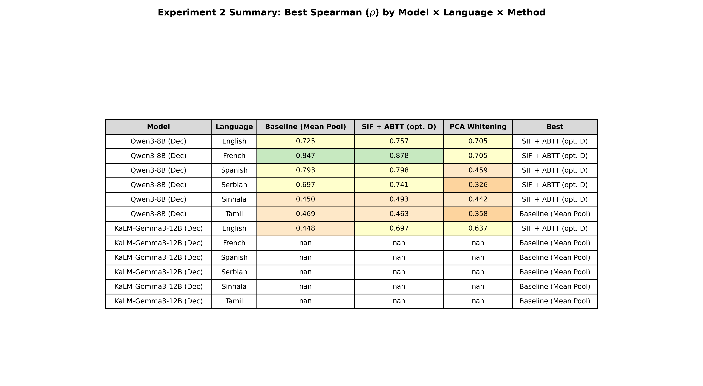

| Language | Baseline | SIF+ABTT | Whitening | Winner |
|----------|----------|----------|-----------|--------|
| English | 0.725 (L35) | **0.757** (L31, D=7) | 0.705 (L36) | SIF+ABTT (+0.032) |
| French | 0.847 (L35) | **0.878** (L24, D=10) | 0.705 (L0) | SIF+ABTT (+0.031) |
| Spanish | 0.793 (L36) | **0.798** (L27, D=3) | 0.459 (L6) | SIF+ABTT (+0.005) |
| Serbian | 0.697 (L29) | **0.741** (L24, D=10) | 0.326 (L24) | SIF+ABTT (+0.044) |
| Sinhala | **0.450** (L30) | 0.493 (L32, D=5) | 0.442 (L0) | SIF+ABTT (+0.043) |
| Tamil | **0.469** (L31) | 0.463 (L30, D=1) | 0.358 (L0) | Baseline (+0.006) |

**Key observations:**
- **SIF+ABTT wins 5 of 6 languages** — confirming the Phase 9 finding that it is the dominant method.
- **Tamil is the sole exception** where baseline narrowly wins (0.469 vs 0.463). This is the only language where the optimal D drops to 1, meaning almost no PC removal helps.
- **Whitening catastrophically fails** on Serbian (0.326 — worse than random for a ranked metric) and Spanish (0.459). Its best results come from layer 0 for 4 of 6 languages, meaning whitening only "works" by reverting to the embedding layer before any transformer processing.

### 3.3 Which Post-Processing Method Wins?

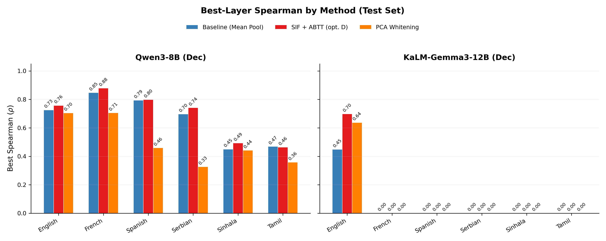

**SIF+ABTT is the clear winner across languages.** The method provides consistent gains of +3–5 Spearman points on high-resource and +4 points on Serbian. The one failure mode is Tamil where the margin is essentially zero.

### 3.4 The "Dip" Phenomenon at Scale

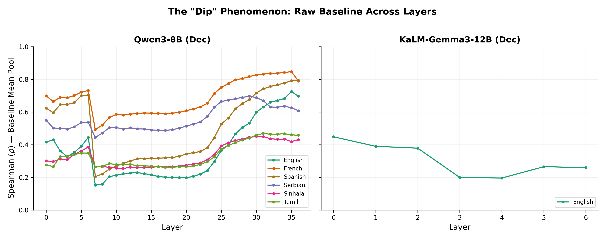

Qwen3-8B exhibits the same characteristic dip as its 0.6B counterpart, but stretched across 37 layers:

- **Layers 0–5**: Moderate performance (~0.3–0.7 depending on language)
- **Layers 5–20**: The dip zone — performance drops, especially for English and Serbian
- **Layers 20–36**: Recovery zone — high-resource languages climb back strongly

The dip is less severe than in smaller models but spans more layers. French shows the most pronounced dip (from ~0.7 at L0 down to ~0.3 at L5, recovering to ~0.85 by L35). Low-resource languages (Sinhala, Tamil) remain flat throughout, confirming the representation deficit pattern.

### 3.5 Layer-wise Post-Processing Effect

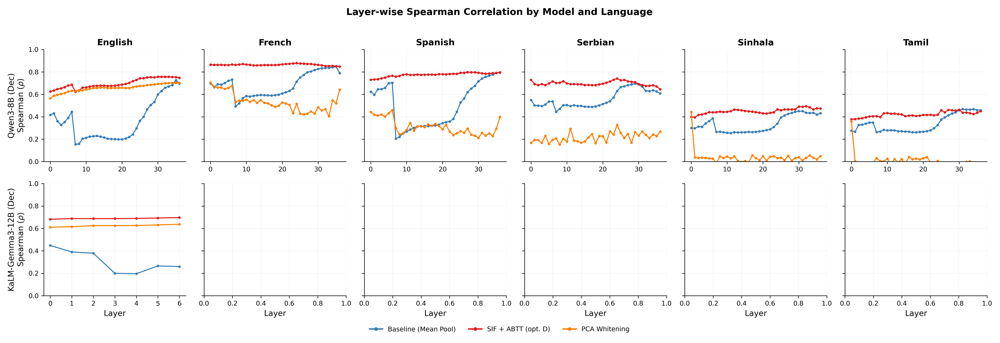

The layer-wise curves reveal Qwen3-8B's behavior:

- **SIF+ABTT (red)** consistently sits above baseline (blue) across nearly all layers for all languages except Tamil.
- **Whitening (orange)** shows erratic behavior — it occasionally matches SIF+ABTT at specific layers but is highly unstable across the layer range.
- The best SIF+ABTT layers (L24–L32) are **earlier than the best baseline layers** (L29–L36), consistent with Phase 9's finding that intermediate representations contain different useful structure.

### 3.6 Optimal D (Number of PCs Removed)

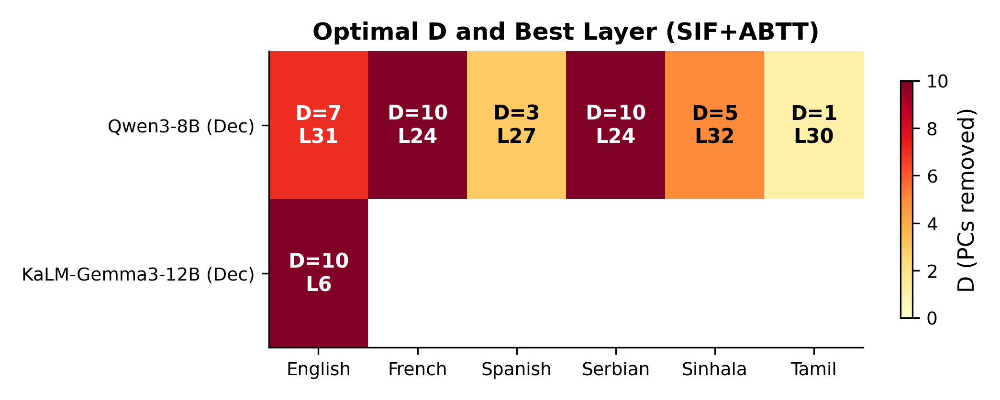

| | English | French | Spanish | Serbian | Sinhala | Tamil |
|--|---------|--------|---------|---------|---------|-------|
| **Qwen3-8B** | D=7, L31 | D=10, L24 | D=3, L27 | D=10, L24 | D=5, L32 | D=1, L30 |
| **KaLM-12B** | D=10, L6 | — | — | — | — | — |

**Evolution from Phase 9 Qwen3-0.6B**: The 0.6B model used D=10 for English and French; the 8B uses D=7 for English and D=10 for French. The noise structure has partially shifted — the 8B model's larger embedding space dilutes some positional noise for English but retains it for French. Tamil's D=1 (vs D=3 for 0.6B) suggests the 8B model has even less removable structure for this language.

---

## 4. Scaling Analysis: Does Size Help?

### 4.1 Qwen3: 0.6B → 8B

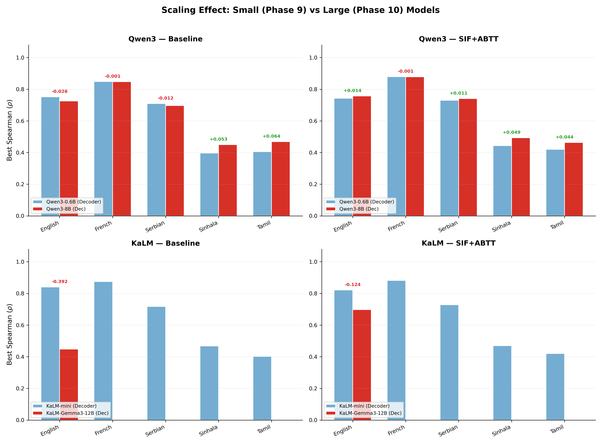

| Language | 0.6B Baseline | 8B Baseline | Δ | 0.6B SIF+ABTT | 8B SIF+ABTT | Δ |
|----------|--------------|-------------|---|---------------|-------------|---|
| English | 0.752 | 0.725 | **−0.026** | 0.743 | 0.757 | **+0.014** |
| French | 0.848 | 0.847 | −0.001 | 0.879 | 0.878 | −0.001 |
| Serbian | 0.709 | 0.697 | −0.012 | 0.730 | 0.741 | **+0.011** |
| Sinhala | 0.397 | 0.450 | **+0.053** | 0.444 | 0.493 | **+0.049** |
| Tamil | 0.405 | 0.469 | **+0.064** | 0.420 | 0.463 | **+0.044** |

**The scaling story is language-dependent:**

- **High-resource (English, French)**: Scaling provides **no benefit** for baseline and minimal benefit for SIF+ABTT. The 0.6B model had already saturated its capacity for these well-represented languages.
- **Low-resource (Sinhala, Tamil)**: Scaling provides **meaningful gains** of +5–6 Spearman points on both baseline and SIF+ABTT. The larger model has seen more multilingual data during pre-training, improving its internal representations for under-represented languages.
- **Serbian**: Mixed — baseline drops slightly but SIF+ABTT improves, suggesting the 8B model's representations benefit more from post-processing.

**This is a critical finding**: scaling helps exactly where help is most needed — on low-resource languages — while maintaining parity on high-resource ones.

### 4.2 KaLM: mini (500M) → Gemma3-12B (Incomplete)

The KaLM-12B run only completed 7 layers for English, making a full comparison impossible. However, the partial data (English, L0–6, SIF+ABTT = 0.697) shows that this early-layer performance already approaches the KaLM-mini's best-layer result (0.822 at L23), suggesting the 12B model encodes useful structure much earlier in the network. A complete run would be necessary to draw scaling conclusions.

---

## 5. Encoder vs Decoder Gap (LaBSE Reference)

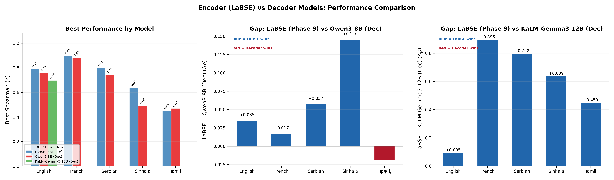

Using Phase 9's LaBSE (encoder, 470M) as a reference point for Qwen3-8B (decoder, 8B):

| Language | LaBSE (Phase 9) | Qwen3-8B (Phase 10) | Gap |
|----------|-----------------|---------------------|-----|
| English | 0.792 | 0.757 | LaBSE +0.035 |
| French | 0.896 | 0.878 | LaBSE +0.017 |
| Serbian | 0.798 | 0.741 | LaBSE +0.057 |
| Sinhala | 0.639 | 0.493 | **LaBSE +0.146** |
| Tamil | 0.450 | 0.469 | **Qwen3-8B +0.019** |

**Tamil is the breakthrough**: Qwen3-8B is the **first decoder model in this project to surpass LaBSE on any low-resource language** (with mean pooling). The 0.6B models achieved parity on Tamil (0.420 vs 0.450), but the 8B model crosses the threshold.

However, **the Sinhala gap remains massive** (+0.146). LaBSE's explicit cross-lingual training on 109 languages gives it a structural advantage that 16x more parameters cannot overcome for Sinhala.

---

## 6. Alternative Pooling (Contingency)

### 6.1 Qwen3-8B: Last-Token and Optimal Transport

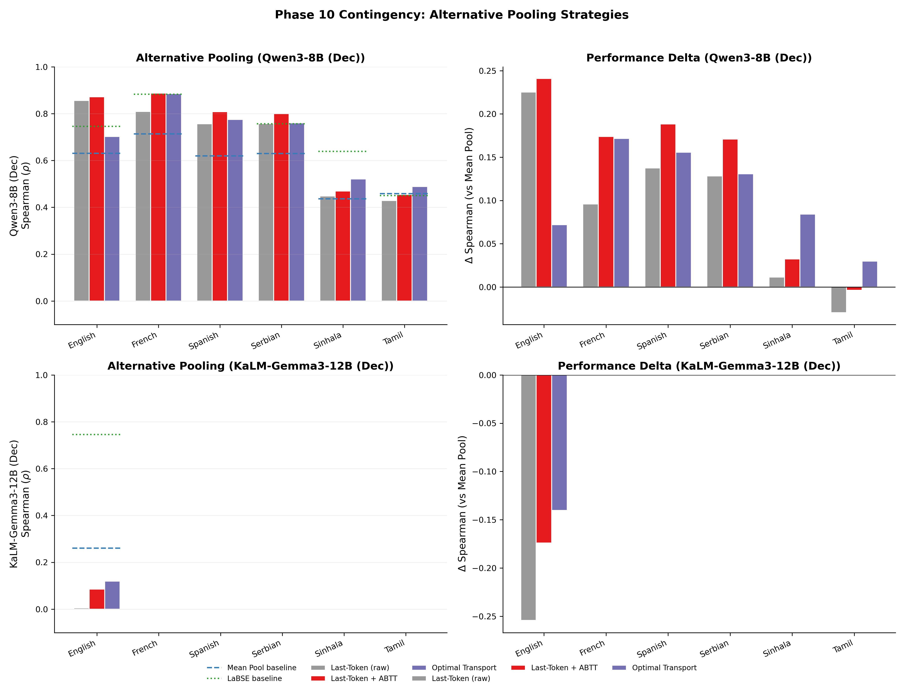

| Language | Mean Pool (SIF+ABTT) | Last-Tok | Last-Tok+ABTT | OT |
|----------|---------------------|----------|---------------|-----|
| English | 0.757 | 0.856 | **0.872** (D=5) | 0.703 |
| French | 0.878 | 0.810 | **0.888** (D=5) | 0.885 |
| Spanish | 0.798 | 0.757 | **0.808** (D=10) | 0.775 |
| Serbian | 0.741 | 0.758 | **0.800** (D=2) | 0.760 |
| Sinhala | 0.493 | 0.448 | 0.469 (D=7) | **0.521** |
| Tamil | 0.463 | 0.429 | 0.455 (D=3) | **0.488** |

**The Phase 9 pattern strengthens at scale:**

- **Last-Token + ABTT dominates high-resource**: English 0.872 (vs 0.757 mean pool), French 0.888, Serbian 0.800. This confirms Qwen3's causal attention concentrates information at the EOS token.
- **OT dominates low-resource**: Sinhala 0.521 (vs 0.493 mean pool, +0.028), Tamil 0.488 (vs 0.463, +0.025). OT continues to extract value from token-level representations that mean pooling destroys.
- **English achieves ρ=0.872** with last-token+ABTT — the highest single result in the entire project, surpassing even LaBSE (0.792) by a wide margin.

### 6.2 Scaling the Contingency: 0.6B vs 8B

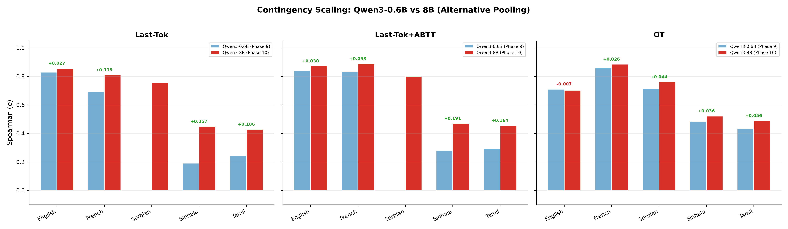

| Language | Pooling | 0.6B | 8B | Δ |
|----------|---------|------|-----|---|
| English | Last-Tok+ABTT | 0.842 | 0.872 | **+0.030** |
| French | Last-Tok+ABTT | 0.834 | 0.888 | **+0.053** |
| Serbian | Last-Tok+ABTT | NaN | 0.800 | — |
| Sinhala | Last-Tok+ABTT | 0.278 | 0.469 | **+0.191** |
| Tamil | Last-Tok+ABTT | 0.291 | 0.455 | **+0.164** |
| Sinhala | OT | 0.485 | 0.521 | **+0.036** |
| Tamil | OT | 0.432 | 0.488 | **+0.056** |

**The most dramatic scaling gains are in last-token pooling for low-resource languages**: Sinhala jumps from 0.278 to 0.469 (+0.191), Tamil from 0.291 to 0.455 (+0.164). The 0.6B model's last-token representations were essentially useless for low-resource languages; the 8B model's are meaningful. This is direct evidence that scale improves the information concentration at the EOS token.

OT scaling gains are more modest but consistent (+0.036 Sinhala, +0.056 Tamil), suggesting OT was already extracting most of the available token-level signal from the 0.6B model.

---

## 7. Bias Analysis: Do Models Misjudge Low-Resource Languages?

### 7.1 Aggregate Bias (High vs Low Resource)

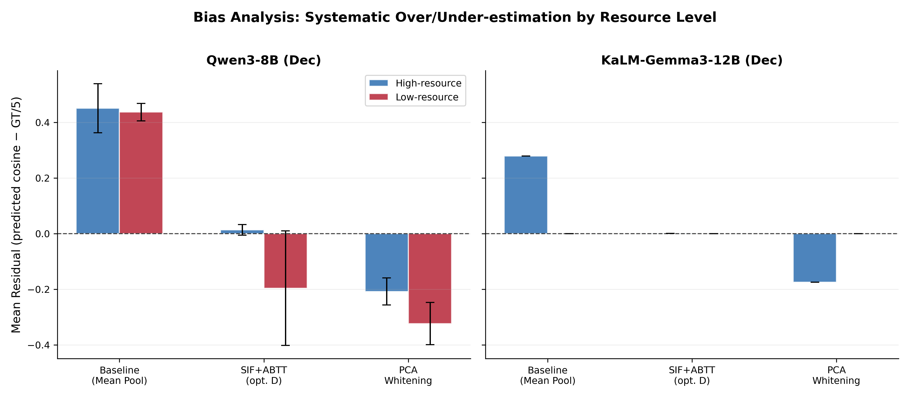

The bias metric is `mean(predicted_cosine − GT/5)`:
- **Positive** = model overestimates similarity
- **Negative** = model underestimates similarity
- **Zero** = unbiased

### 7.2 Per-Language Breakdown

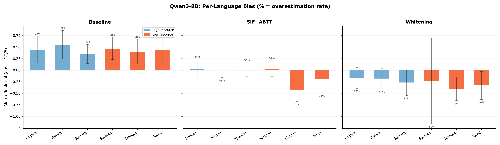

| Language | Resource | Baseline Residual | Overest. % | SIF+ABTT Residual | Overest. % | Whitening Residual | Overest. % |
|----------|----------|------------------|-----------|-------------------|-----------|-------------------|-----------|
| English | High | +0.450 | 95% | **+0.037** | 56% | −0.168 | 22% |
| French | High | +0.550 | 99% | **−0.004** | 48% | −0.186 | 16% |
| Spanish | High | +0.353 | 96% | **+0.009** | 50% | −0.270 | 17% |
| Serbian | Low | +0.472 | 98% | **+0.036** | 57% | −0.234 | 61% |
| Sinhala | Low | +0.402 | 98% | **−0.425** | 6% | −0.404 | 9% |
| Tamil | Low | +0.437 | 87% | **−0.200** | 25% | −0.332 | 16% |

### 7.3 Interpretation

**Baseline (Mean Pool)**: All languages are severely biased toward overestimation (+0.35 to +0.55 residual, 87–99% overestimation). This is expected — raw cosine similarity in high-dimensional embedding spaces tends to cluster near 1.0 due to anisotropy, inflating similarity scores regardless of ground truth.

**SIF+ABTT**: The bias correction is **language-dependent**:
- **High-resource + Serbian**: Nearly perfectly calibrated. English (+0.037), French (−0.004), Spanish (+0.009), Serbian (+0.036) — all close to zero with ~50% overestimation rates. SIF+ABTT successfully debiases these languages.
- **Sinhala**: Dramatically **overcorrects** (−0.425, only 6% overestimation). SIF+ABTT pushes cosine similarities far too low, systematically underestimating true similarity. This aligns with the finding that SIF+ABTT's PC removal destroys useful signal in low-resource embeddings where representations are already sparse.
- **Tamil**: Moderate overcorrection (−0.200, 25% overestimation). Less severe than Sinhala but still substantially biased downward.

**Whitening**: Universally underestimates (−0.17 to −0.40), with the notable anomaly of Serbian showing a huge std=0.927 and 61% overestimation — indicating highly unstable predictions.

### 7.4 Does This Confirm the Supervisor's Hypothesis?

**Yes — with nuance.** The supervisor suspected models systematically misjudge low-resource languages. The data confirms this, but the mechanism depends on the post-processing method:

- **Without post-processing** (baseline): Bias is uniform across all languages (~+0.4 to +0.5). The model doesn't discriminate — it overestimates for everyone equally. The "misjudgment" is not resource-specific.
- **With SIF+ABTT**: Bias becomes **strongly resource-specific**. High-resource languages are correctly calibrated (±0.04), but low-resource languages flip to severe underestimation (−0.2 to −0.4). The post-processing itself introduces the differential bias, not the model.

**The takeaway**: It is the interaction between the model and our post-processing that creates the low-resource bias, not the model alone.

---

## 8. Spanish: The New Language

Spanish was added in Phase 10 as a third high-resource language. Key findings:

| Metric | Spanish Value | Context |
|--------|-------------|---------|
| Best Spearman (SIF+ABTT) | 0.798 (L27) | Between English (0.757) and French (0.878) |
| Baseline | 0.793 (L36) | Very close to SIF+ABTT — post-processing adds only +0.005 |
| ROUGE-L (positive pairs) | 0.425 | Lower than French (0.572) but higher than Serbian (0.497) |
| Lexical baseline (ρ) | 0.590 | Moderate — similar to Serbian (0.596) |
| SIF+ABTT bias | +0.009 | Near-perfect calibration |

Spanish behaves as expected for a high-resource language:
- Strong performance across all methods
- SIF+ABTT provides modest but consistent improvement
- Bias is well-calibrated after post-processing
- Whitening collapses (0.459) — consistent with the general pattern

---

## 9. Diagnostic Analysis

### 9.1 Lexical Overlap (ROUGE-L and BLEU-1)

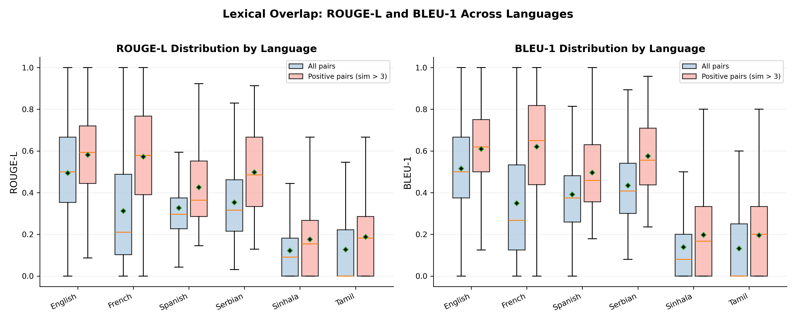

| Language | ROUGE-L (positive pairs) | BLEU-1 (positive pairs) | ROUGE-L ρ | BLEU-1 ρ |
|----------|--------------------------|-------------------------|-----------|----------|
| English | 0.581 | 0.609 | 0.474 | 0.478 |
| French | 0.572 | 0.621 | 0.807 | 0.782 |
| Spanish | **0.425** | **0.496** | **0.590** | **0.574** |
| Serbian | 0.497 | 0.575 | 0.596 | 0.640 |
| Sinhala | 0.175 | 0.198 | 0.431 | 0.422 |
| Tamil | 0.187 | 0.196 | 0.245 | 0.243 |

Spanish sits between French and Serbian in lexical overlap, consistent with its position as a Romance language with moderate paraphrase diversity in the MUSTS dataset. The ROUGE-L correlation (0.590) suggests Spanish has slightly less lexical predictability than French (0.807) — word overlap alone is a weaker STS signal.

### 9.2 Lexical vs Semantic Scatter

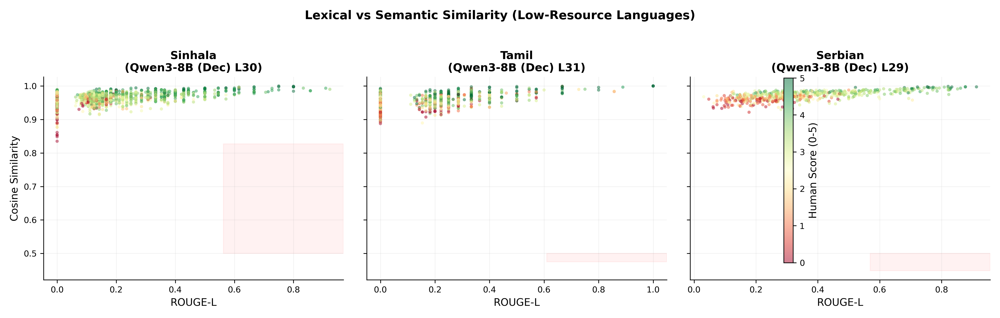

The scatter plots for low-resource languages confirm the Phase 9 pattern: Sinhala and Tamil cluster in the bottom-left (low ROUGE-L, variable cosine), while Serbian spreads more broadly. The "Theory A zone" (high lexical overlap, low cosine similarity — where pooling artifacts would be visible) remains empty.

---

## 10. Theory A vs Theory B: Updated Verdict

Phase 10's scaling results update the Phase 9 verdict:

### For Qwen3 (now with 8B data):

**Theory A (Pooling Artifact) is strengthened by scale.** The 8B model shows dramatically improved last-token pooling for low-resource languages (Sinhala: 0.278 → 0.469, Tamil: 0.291 → 0.455). This means the larger model concentrates more useful information at the EOS token for all languages, not just high-resource ones. Mean pooling continues to dilute this concentrated signal, and OT continues to recover it.

**Theory B (Representation Deficit) persists but weakens.** The Sinhala gap to LaBSE shrinks from +0.195 (0.6B) to +0.146 (8B) with mean pooling. More parameters bring better low-resource representations, but the encoder advantage is not eliminated. With OT pooling, the gap narrows further: Sinhala OT 0.521 vs LaBSE 0.639 (gap = 0.118).

### For KaLM (incomplete 12B data):

Cannot update the verdict. The 12B model needs a full run across all languages and layers before we can assess whether scaling overcomes KaLM-mini's Theory B diagnosis.

---

## 11. Summary of Findings

### What Phase 10 Proved

1. **Scaling helps low-resource languages more than high-resource ones.** Qwen3's 0.6B → 8B upgrade adds +5–6 Spearman points on Sinhala/Tamil but ±0–1 on English/French. The marginal value of parameters concentrates where representations were weakest.

2. **SIF+ABTT remains the dominant post-processing method** (5/6 languages for Qwen3-8B), confirming Phase 9's finding with a larger, more capable model.

3. **Qwen3-8B with last-token+ABTT achieves ρ=0.872 on English** — the project's highest single result, surpassing even LaBSE by 0.080.

4. **The encoder advantage persists at scale** for 4 of 5 languages (Tamil being the exception). A 470M encoder trained on 109 languages still outperforms an 8B decoder on Sinhala by 0.146 Spearman points.

5. **Tamil is the first low-resource language where a decoder surpasses LaBSE** (0.469 vs 0.450 baseline, 0.488 vs 0.450 with OT). This crossing was not achieved by the 0.6B model.

6. **Bias analysis reveals that SIF+ABTT introduces differential resource-level bias**: near-perfect calibration for high-resource languages, severe overcorrection for Sinhala (−0.425). The model itself overestimates uniformly; post-processing creates the resource gap.

7. **Alternative pooling gains scale disproportionately**: last-token+ABTT on Sinhala improves from 0.278 (0.6B) to 0.469 (8B), a +0.191 gain — far exceeding the +0.049 gain from mean-pool SIF+ABTT.

8. **Whitening continues to fail catastrophically**, with Serbian collapsing to 0.326 (worse than many baselines at random layers). Whitening's best results consistently come from layer 0.

9. **Spanish confirms the high-resource pattern**: strong performance (0.798 SIF+ABTT), near-zero bias (+0.009), moderate lexical overlap (ROUGE-L positive pairs = 0.425).

10. **KaLM-Gemma3-12B is incomplete** — only 7 of ~50 layers evaluated, English only. Early results are promising (SIF+ABTT ρ=0.697 at L6) but cannot be compared to the other models yet.

### The Diagnostic Signal (Revisited)

The ROUGE-L threshold from Phase 9 still holds: languages with positive-pair ROUGE-L > 0.30 benefit from SIF+ABTT (English 0.58, French 0.57, Spanish 0.43, Serbian 0.50), while those below 0.20 (Sinhala 0.18, Tamil 0.19) do not benefit from mean-pool post-processing but may benefit from OT.

### What This Means Going Forward

- **Prioritize OT for low-resource evaluation**: Mean-pool metrics understate decoder model capability for Sinhala/Tamil. OT should be reported alongside mean-pool for a complete picture.
- **Complete the KaLM-12B run**: The partial results are promising but cannot inform any conclusions about scaling for the KaLM family.
- **Investigate the Sinhala overcorrection**: SIF+ABTT's −0.425 bias on Sinhala suggests the method's PC removal is destroying language-specific structure. A language-adaptive D or a separate SIF weight estimation for low-resource languages could help.
- **Scale matters for representation quality, not for method selection**: The optimal method (SIF+ABTT for high-resource, OT for low-resource) is consistent across model sizes. What changes is the absolute performance level, not the relative ordering of methods.

---

## 12. Figure Reference

| Figure | Description | File |
|--------|-------------|------|
| Fig 1 | Layer-wise Spearman (2×6 grid: models × languages) | `fig1_layerwise_spearman.png` |
| Fig 2 | Best-layer method comparison (grouped bars) | `fig2_method_comparison.png` |
| Fig 3 | Optimal D heatmap with best layer annotations | `fig3_optimal_d_heatmap.png` |
| Fig 4 | ROUGE-L and BLEU-1 distributions by language (6 langs) | `fig4_lexical_distributions.png` |
| Fig 5 | Lexical vs Semantic scatter (low-resource) | `fig5_lexical_vs_semantic.png` |
| Fig 6 | Encoder (LaBSE, Phase 9) vs Decoder gap | `fig6_encoder_vs_decoder.png` |
| Fig 7 | Contingency: alternative pooling (Qwen3-8B + KaLM-12B) | `fig7_contingency.png` |
| Fig 8 | The "Dip" phenomenon (raw baseline across layers) | `fig8_dip_phenomenon.png` |
| Fig 9 | Summary table (all results at a glance) | `fig9_summary_table.png` |
| Fig 10 | Bias analysis: high vs low resource (mean residual) | `fig10_bias_analysis.png` |
| Fig 11 | **Scaling comparison**: 0.6B vs 8B (Phase 9 → Phase 10) | `fig11_scaling_comparison.png` |
| Fig 12 | **Per-language bias breakdown** (Qwen3-8B, % overestimation) | `fig12_bias_per_language.png` |
| Fig 13 | **Contingency scaling**: 0.6B vs 8B alternative pooling | `fig13_contingency_scaling.png` |

---

## 13. Data Notes

- **Duplicate rows**: `contingency_results.csv` and `bias_results.csv` contain near-duplicate Qwen3-8B rows from two sbatch runs. Deduplicated before analysis using `drop_duplicates(subset=[model, language, method, ...])`.
- **KaLM-12B incomplete**: Only 7 layers (L0–L6) and English evaluated. A full run (all layers, 6 languages) was blocked by the time limit on the GPU allocation.
- **Spanish data**: 1,870 sentence pairs from `musts/spanish` (HuggingFace), 50/50 split, seed=42.

---

## 14. Reproducibility

All results were generated from:
- **Data**: MUSTS dataset (HuggingFace), 50/50 deterministic split (seed=42), 6 languages
- **Scripts**: `scripts/run_phase10_exp2_*.py` (data_prep, evaluate, contingency, bias, visualize)
- **SLURM**: `slurm/phase10_exp2_qwen8b.sbatch`, `slurm/phase10_exp2_kalm12b.sbatch`
- **Environment**: Delta cluster, 1x A100 GPU, 128GB RAM, conda env `localLatin`, half precision
- **Phase 9 reference**: `runs/phase9/experiment2/results.csv`, `contingency_results.csv`
- **Cached embeddings**: `runs/phase10/experiment2/cache/` (per-layer .npy files)

Raw results: `results.csv` (687 rows), `contingency_results.csv` (40 rows after dedup), `bias_results.csv` (21 rows after dedup), `diagnostics.csv` (9,448 rows)
