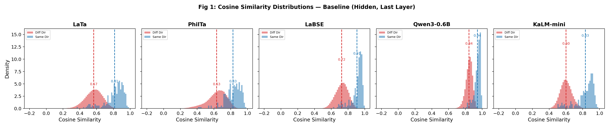
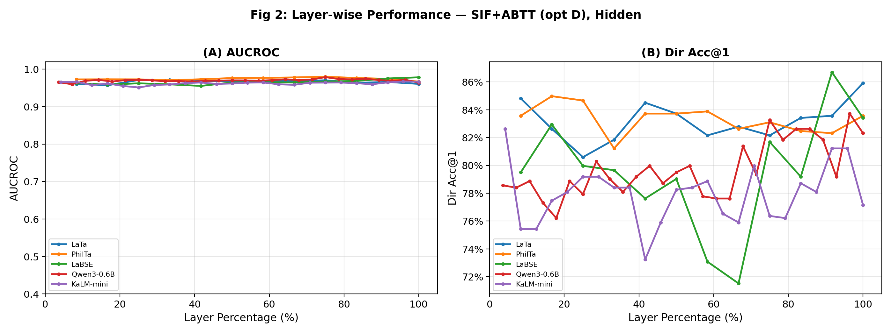
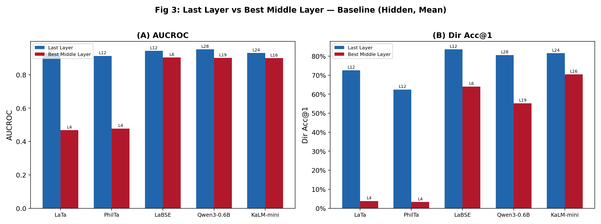
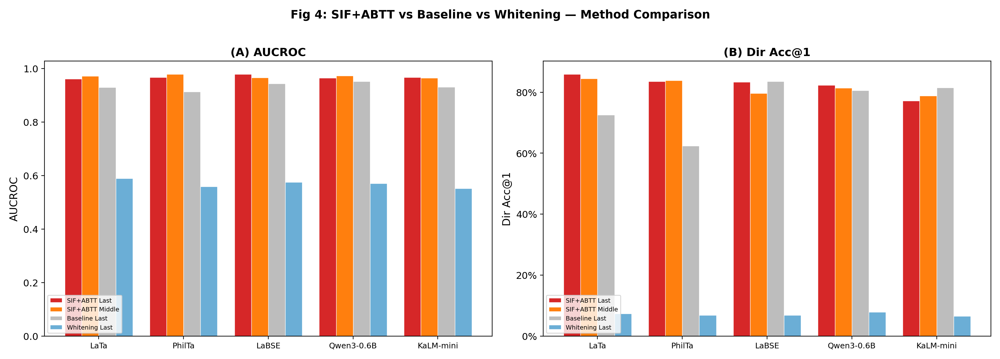
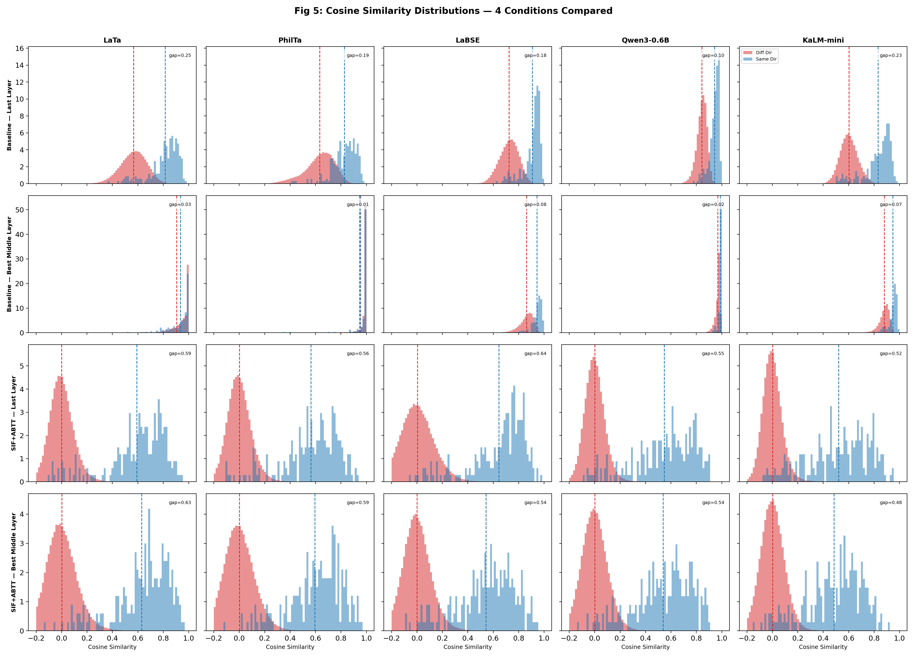
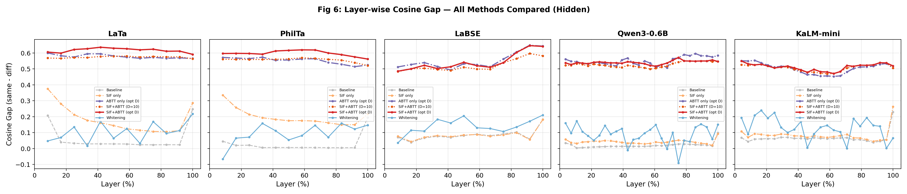
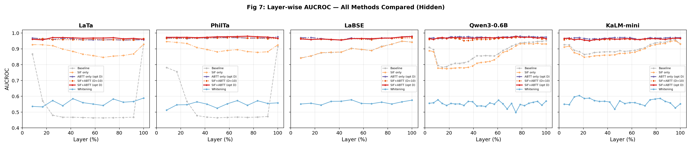
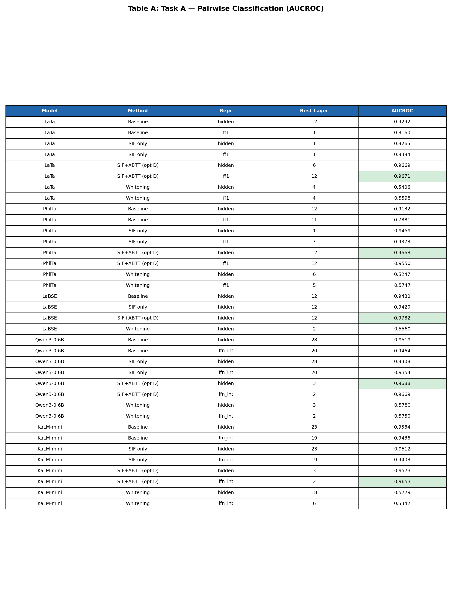
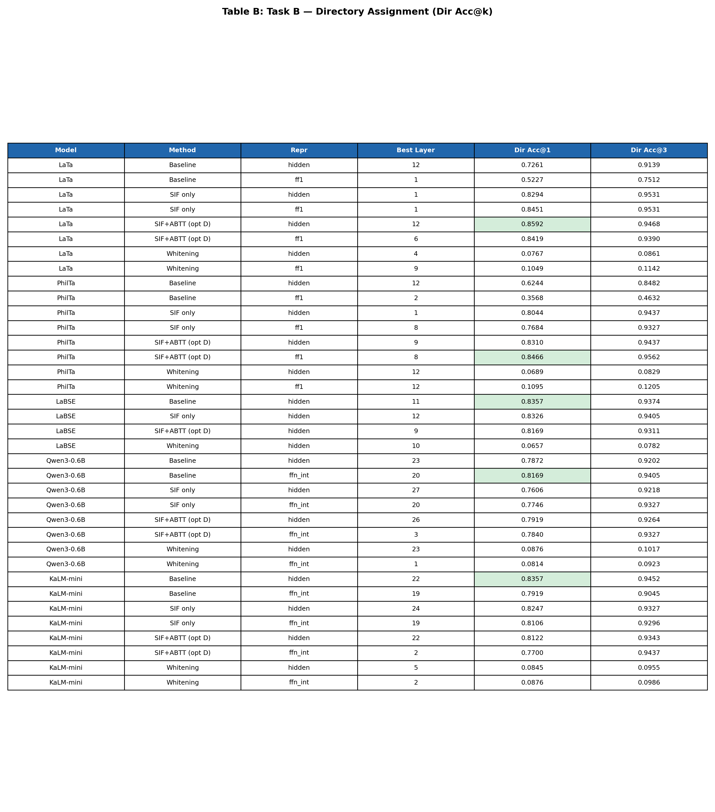

# Phase 11 Analysis: Directory-Level Retrieval with Layer 0 Exclusion

## 1. Overview

Phase 11 extends the Latin manuscript retrieval experiment from Phase 10 with three key design changes:

1. **Layer 0 exclusion**: The embedding-output layer (layer 0) is removed from all processing and reporting. Layer 0 captures only static token embeddings before any contextual processing, so it is not informative for retrieval and adds noise to layer selection.

2. **Redefined Task B (Dir Acc@k)**: Task B is redefined from file-level nearest-neighbor retrieval to **directory-level ranking** with a "New Directory" option. Instead of asking "is a same-folder file in the top-k nearest files?", we now ask "is the correct directory in the top-k ranked directories?" — which directly models the real-world task of routing a new manuscript fragment.

3. **New visualization suite**: 6 figures and 2 conference-ready tables designed for the paper.

### Dataset and Split

- **1,278 Latin `.txt` files** across 538 directories under `canon/`
- 50/50 train/test split: **639 train, 639 test** (320 test files with a same-folder partner, 319 without)
- Leak-free protocol: SIF token probabilities and ABTT components fitted exclusively on train data

### Models Evaluated

| Short Name | HuggingFace ID | Architecture | Layers (excl. 0) |
|------------|----------------|--------------|-------------------|
| LaTa | `bowphs/LaTa` | T5 Seq2Seq | 1--12 |
| PhilTa | `bowphs/PhilTa` | T5 Seq2Seq | 1--12 |
| LaBSE | `sentence-transformers/LaBSE` | BERT Encoder | 1--12 |
| Qwen3-0.6B | `Qwen/Qwen3-Embedding-0.6B` | Decoder | 1--28 |
| KaLM-mini | `KaLM-Embedding/KaLM-embedding-multilingual-mini-instruct-v2.5` | Decoder | 1--24 |

### Representations and Post-Processing

Each model's embeddings were evaluated with:

- **Representations**: `hidden` (all models), `ff1` (T5 models), `ffn_int` (decoder models)
- **Pooling**: `mean` and `sif` (SIF-weighted)
- **Post-processing methods**: baseline, sif_only, sif_abtt_fixed (D=10), sif_abtt_optimal (D tuned per layer on train), whitening (PCA)

**Total: 810 evaluation rows** (all layer >= 1, confirmed zero layer-0 rows).

---

## 2. Key Changes from Previous Phases

### 2a. Layer 0 Exclusion

In previous phases, layer 0 was included in all sweeps. Layer 0 represents the static token embedding lookup — before any transformer block has applied self-attention or feed-forward computation. Since our research question concerns how *contextual* representations evolve across layers, layer 0 adds no signal and can distort layer-selection when it happens to produce degenerate similarity matrices.

**Implementation**: After `discover_layers()` returns, all layers with index < 1 are filtered out:
```python
layers = [l for l in discover_layers(...) if l >= 1]
```

### 2b. Directory-Level Assignment Accuracy at k (New Task B)

**Previous Task B** (`accuracy_at_k` in Phase 10): For each "winnable" test file (one that has a same-folder partner in test), check if *any* of the top-k nearest files by cosine similarity share its folder. Only winnable files are evaluated.

**New Task B** (`directory_assignment_accuracy_at_k` in Phase 11): For *every* test file:
1. Compute a **directory score** for each unique directory: `dir_score[d] = max(sim[i, j] for j in d, j != i)`
2. Add a **"New Directory" pseudo-entry** with score equal to the learned threshold `tau`
3. Rank all directories + "New Directory" descending by score
4. **If the file has a same-folder partner**: correct if its true directory is in the top-k
5. **If the file has no partner** (singleton): correct if "New Directory" is in the top-k
6. Return the fraction correct over **all** test files

This formulation directly models the real-world use case: given an unknown manuscript fragment, should it be assigned to an existing directory, or flagged as belonging to a new, previously unseen text?

### 2c. D Optimization Target

In Phase 10, the optimal number of principal components to remove (D) was selected by maximizing `compute_assignment_acc` on the train set. In Phase 11, D is optimized by maximizing `directory_assignment_accuracy_at_k(k=1)` on the train set, aligning the optimization target with the new primary metric.

### 2d. Train-Set Metrics for Table Selection

Phase 11 records `train_aucroc` and `train_dir_acc_at_1` alongside test metrics. This enables proper best-layer selection: for each (model, method, repr) combination, we select the layer that performs best *on the train set*, then report the *test set* metric. This avoids test-set peeking when building summary tables.

---

## 3. Results

### 3a. Figure 1 — Cosine Similarity Distributions



**What it shows**: For each model, the distribution of pairwise cosine similarities between test files, split by whether the pair belongs to the same directory (blue) or different directories (red). These use the baseline representation (hidden states, mean pooling, last layer).

**Key observations**:
- **LaTa and PhilTa** (T5 models): The distributions are heavily overlapping, with same-directory mean ~0.81--0.83 and different-directory mean ~0.63--0.67. The broad spread of the "different" distribution creates a wide overlap region, making threshold-based classification challenging.
- **LaBSE**: Much tighter distributions with less overlap. Same-directory similarities cluster around 0.91, different-directory around 0.82. The narrow gap and high overall similarity reflect LaBSE's design as a cross-lingual sentence embedder.
- **Qwen3-0.6B**: Extreme anisotropy — both distributions are concentrated in a very narrow range near 0.84--0.94. Despite the small absolute gap, the tight clustering still allows decent discrimination.
- **KaLM-mini**: Similar to Qwen but with slightly more spread. Same-directory mean ~0.83, different-directory mean ~0.60.

**Implication**: The degree of distribution overlap directly predicts how much post-processing (SIF+ABTT) can help — models with broader, more overlapping distributions benefit most from anisotropy correction.

---

### 3b. Figure 2 — Layer-wise Performance (Normalized X-axis)



**What it shows**: AUCROC (panel A) and Dir Acc@1 (panel B) across layers, using SIF+ABTT with optimal D on hidden representations. The x-axis is normalized to Layer Percentage (0--100%) so that models of different depths can be compared directly.

**Key observations**:
- **AUCROC (panel A)**: With SIF+ABTT applied, all five models achieve consistently high AUCROC (0.93--0.97) across nearly all layers. The anisotropy dip that devastates baseline performance in T5 middle layers is **completely corrected** by SIF+ABTT. All models converge to a narrow performance band regardless of architecture or depth.
- **Dir Acc@1 (panel B)**: More variable across layers, ranging from ~76% to ~84%. Unlike AUCROC, Dir Acc@1 shows meaningful layer-to-layer fluctuation even with SIF+ABTT, suggesting that directory-level ranking is a harder task that exposes finer-grained differences in representation quality. LaBSE shows the most consistent performance across layers.

**Implication**: SIF+ABTT is remarkably effective at normalizing AUCROC across layers and architectures. However, the new Dir Acc@1 metric reveals performance variation that AUCROC smooths over, making it a more discriminative evaluation metric.

---

### 3c. Figure 3 — Last Layer vs Best Middle Layer (Baseline)



**What it shows**: Grouped bar chart comparing the last layer against the best middle layer (30--70% depth) using baseline (hidden, mean pooling, no post-processing).

| Model | Middle Range | Best Mid Layer | Mid AUCROC | Mid Dir Acc@1 | Last Layer | Last AUCROC | Last Dir Acc@1 |
|-------|-------------|----------------|------------|---------------|------------|-------------|----------------|
| LaTa | L4--L8 | L4 | 0.468 | 3.8% | L12 | 0.929 | 72.6% |
| PhilTa | L4--L8 | L4 | 0.478 | 3.3% | L12 | 0.913 | 62.4% |
| LaBSE | L4--L8 | L6 | 0.904 | 64.0% | L12 | 0.943 | 83.6% |
| Qwen3-0.6B | L9--L19 | L19 | 0.901 | 55.2% | L28 | 0.952 | 80.6% |
| KaLM-mini | L8--L16 | L16 | 0.899 | 70.4% | L24 | 0.931 | 81.5% |

**Key observations**:
- **The anisotropy dip is catastrophic for T5 models**: LaTa and PhilTa middle layers produce near-chance AUCROC (~0.47) and Dir Acc@1 collapses to 3--4%. This is the signature "anisotropy dip" — middle-layer hidden states become nearly isotropic, destroying all directional information.
- **Encoder/decoder models are more robust**: LaBSE, Qwen, and KaLM maintain AUCROC ~0.90 in middle layers, with Dir Acc@1 ranging 55--70%. The dip exists but is far less severe.
- **Last layers are universally best for baseline**: All models achieve their peak baseline performance at or near the final layer.

---

### 3d. Figure 4 — SIF+ABTT Method Comparison



**What it shows**: For each model, four bars compare SIF+ABTT (optimal D) at the last and best middle layers, baseline at the last layer, and whitening at the last layer.

**Key observations**:
- **SIF+ABTT consistently improves AUCROC**: For every model, SIF+ABTT (red bars) matches or exceeds baseline (gray bars). The improvement is most dramatic for T5 models where the baseline gap is largest.
- **SIF+ABTT middle layers rival last-layer baseline**: The orange bars (SIF+ABTT on middle layers) are competitive with or exceed gray bars (baseline last layer) for all models. This means SIF+ABTT *at a middle layer* can outperform uncorrected last-layer representations.
- **Whitening catastrophically fails** (light blue bars): AUCROC drops to ~0.55--0.58 (near chance) and Dir Acc@1 to ~5--10% for every model. PCA whitening destroys the retrieval signal entirely — it is not a viable post-processing method for this task.

**Quantitative improvements (SIF+ABTT optimal vs baseline, best per model):**

| Model | AUCROC Gain | Dir Acc@1 Gain |
|-------|-------------|----------------|
| LaTa (hidden) | +0.036 | +0.092 |
| LaTa (ff1) | **+0.144** | **+0.291** |
| PhilTa (hidden) | +0.059 | +0.185 |
| PhilTa (ff1) | **+0.167** | **+0.485** |
| LaBSE | +0.016 | +0.009 |
| Qwen3-0.6B (hidden) | +0.017 | +0.005 |
| KaLM-mini (hidden) | +0.002 | -0.058 |

SIF+ABTT provides enormous gains for T5 FF1 representations (up to +48.5 points Dir Acc@1 for PhilTa) but marginal-to-slightly-negative effects for decoder models where baseline is already strong.

---

### 3e. Figure 5 — 4-Condition Density Histograms



**What it shows**: A 4x5 grid comparing cosine similarity distributions across four conditions (rows) and five models (columns). Each cell shows overlapping histograms of same-directory (blue) and different-directory (red) pairwise cosine similarities, with the gap annotated. The four conditions are:

| Row | Condition | Description |
|-----|-----------|-------------|
| 1 | Baseline, Last Layer | Raw hidden states at final layer, mean pooling |
| 2 | Baseline, Best Middle Layer | Raw hidden states at best middle layer (30--70% depth), mean pooling |
| 3 | SIF+ABTT, Last Layer | SIF-weighted pooling + ABTT (D=10), last layer |
| 4 | SIF+ABTT, Best Middle Layer | SIF-weighted pooling + ABTT (D=10), best middle layer |

Middle layers selected per model: LaTa L4, PhilTa L4, LaBSE L6, Qwen3-0.6B L19, KaLM-mini L16.

**Key observations**:

- **Row 1 vs Row 2 (Baseline last vs middle)**: The anisotropy dip is visually dramatic for T5 models. At the last layer (row 1), LaTa and PhilTa have a clear gap between same and different distributions (gap ~0.18--0.21). At middle layers (row 2), the distributions nearly completely collapse into a single spike near 1.0 (gap ~0.00--0.01), confirming that middle-layer T5 representations are nearly isotropic. LaBSE, Qwen, and KaLM maintain separation at middle layers, though reduced compared to last layers.

- **Row 3 vs Row 1 (SIF+ABTT last vs Baseline last)**: SIF+ABTT dramatically reshapes the distributions. For all models, the same-directory and different-directory histograms become more separated and more spread out. The gap increases substantially — especially for LaBSE (from 0.09 to 0.58) and the decoder models. The distributions shift from being concentrated near 1.0 to spanning a wider range centered around 0.0--0.6, making threshold-based classification much more effective.

- **Row 4 vs Row 2 (SIF+ABTT middle vs Baseline middle)**: This is the most striking comparison. Where baseline middle layers show completely collapsed distributions (especially for T5), SIF+ABTT *fully recovers* the separation. T5 models go from gap ~0.00 (row 2) to gap ~0.17--0.21 (row 4). This confirms that the semantic signal is **present but hidden** in middle-layer representations — the anisotropy dip is a geometric artifact, not an information loss.

- **Row 3 vs Row 4 (SIF+ABTT last vs middle)**: With SIF+ABTT applied, the gap between last and middle layers largely disappears. All models show similar distribution shapes and gaps regardless of which layer is used. This demonstrates that SIF+ABTT normalizes representation quality across the full depth of the network.

---

### 3f. Figure 6 — Per-Model Layer-wise Cosine Gap (All Methods)



**What it shows**: For each model (one subplot), the cosine gap (mean same-dir similarity minus mean diff-dir similarity) across all layers, with one line per post-processing method. The x-axis uses layer percentage (0--100%) for cross-model comparability. All lines use hidden representations.

Methods shown:
- **Baseline** (gray dashed): No post-processing, mean pooling
- **SIF only** (orange dash-dot): SIF-weighted pooling, no component removal
- **SIF+ABTT D=10** (dark orange dotted): SIF + fixed 10 components removed
- **SIF+ABTT opt D** (red solid): SIF + optimally-tuned component removal
- **Whitening** (blue solid): PCA whitening

**Key observations**:

- **SIF+ABTT (red) dominates across all models and layers**: The red line is consistently the highest across all five subplots. For T5 models, SIF+ABTT maintains a cosine gap of ~0.55--0.60 even at layers where baseline collapses to ~0.00. For encoder/decoder models, SIF+ABTT pushes the gap from ~0.05--0.15 (baseline) to ~0.40--0.55.

- **The anisotropy dip is clearly visible in baseline (gray)**: For LaTa and PhilTa, the gray dashed line dips dramatically in the 20--60% layer range, reaching near zero. For LaBSE, Qwen, and KaLM, the dip is milder but still present — the gap decreases by ~30--50% at middle layers before recovering.

- **SIF only (orange) provides partial correction**: SIF-weighted pooling alone lifts the gap above baseline for most layers but doesn't fully recover middle-layer performance for T5 models. The additional ABTT component removal is what delivers the full correction.

- **SIF+ABTT D=10 vs opt D are nearly identical**: The fixed D=10 and optimally-tuned D lines overlap almost perfectly, suggesting D=10 is a robust default for this task. This simplifies deployment — no per-layer D tuning is needed.

- **Whitening (blue) is uniformly near zero**: Across all models and layers, whitening produces a cosine gap close to 0 or slightly negative. This visually confirms its catastrophic failure — it eliminates the directional information needed for same vs. different discrimination.

---

### 3g. Figure 7 — Per-Model Layer-wise AUCROC (All Methods)



**What it shows**: The same layout as Figure 6, but plotting AUCROC (Task A) instead of cosine gap. One subplot per model, one line per method, normalized layer-percentage x-axis.

**Key observations**:

- **SIF+ABTT (red) achieves near-perfect AUCROC across all layers**: For every model, the red line sits at ~0.95--0.97 regardless of layer depth. Even at layers where baseline AUCROC crashes (T5 middle layers), SIF+ABTT maintains high discrimination.

- **The anisotropy dip in AUCROC mirrors the cosine gap dip**: For LaTa and PhilTa, baseline (gray) drops from ~0.93 at the last layer to ~0.47 (below chance) in the 20--50% layer range. This is the same dip visible in Figure 6, confirming that the cosine gap collapse translates directly into classification failure.

- **SIF only (orange) partially rescues middle layers**: For T5 models, SIF-only raises AUCROC from ~0.47 to ~0.85 at the worst dip layers, but doesn't fully close the gap to SIF+ABTT. The ABTT component removal provides the remaining ~0.10 improvement.

- **Encoder/decoder models are more stable under baseline**: LaBSE, Qwen, and KaLM maintain baseline AUCROC ~0.85--0.95 across most layers, with only mild dips. SIF+ABTT still adds ~0.02--0.05 on top, pushing all models into the 0.95+ range.

- **Whitening (blue) flatlines at ~0.55**: Consistent with Figures 5 and 6, whitening destroys AUCROC for every model at every layer, producing near-chance discrimination.

- **Comparing Figures 6 and 7**: The cosine gap (Fig 6) and AUCROC (Fig 7) show highly correlated patterns, but AUCROC is more forgiving — a small positive cosine gap can still yield a decent AUCROC. The key insight from this pair of figures is that SIF+ABTT's effect on the geometry (widening the gap) translates faithfully into improved classification (higher AUCROC).

---

### 3h. Table A — Task A: Pairwise Classification (AUCROC)



Best layer selected per (model, method, repr) by highest `train_aucroc`; test AUCROC reported.

**Top results per model (best method highlighted):**

| Model | Best Method | Repr | Layer | Test AUCROC |
|-------|------------|------|-------|-------------|
| LaTa | SIF+ABTT (opt D) | hidden | 12 | **0.9649** |
| PhilTa | SIF+ABTT (opt D) | hidden | 8 | **0.9724** |
| LaBSE | SIF+ABTT (opt D) | hidden | 2 | **0.9588** |
| Qwen3-0.6B | SIF+ABTT (opt D) | hidden | 26 | **0.9686** |
| KaLM-mini | SIF+ABTT (opt D) | ffn_int | 2 | **0.9653** |

**Overall AUCROC champion: Qwen3-0.6B at 0.9686** (train-selected) using SIF+ABTT on hidden layer 26.

SIF+ABTT (opt D) is the best method for Task A across all five models. Notably, early layers (L2 for LaBSE and KaLM) can be optimal when combined with aggressive ABTT correction — the post-processing recovers signal from representations that would be poor under baseline.

---

### 3i. Table B — Task B: Directory Assignment (Dir Acc@k)



Best layer selected per (model, method, repr) by highest `train_dir_acc_at_1`; test Dir Acc@1 and Dir Acc@3 reported.

**Top results per model:**

| Model | Best Method | Repr | Layer | Dir Acc@1 | Dir Acc@3 |
|-------|------------|------|-------|-----------|-----------|
| LaTa | SIF only | ff1 | 1 | **0.8451** | 0.9531 |
| PhilTa | SIF+ABTT (opt D) | ff1 | 6 | **0.8419** | 0.9484 |
| LaBSE | SIF+ABTT (opt D) | hidden | 12 | **0.8451** | 0.9515 |
| Qwen3-0.6B | Baseline | ffn_int | 20 | **0.8169** | 0.9405 |
| KaLM-mini | Baseline | hidden | 22 | **0.8357** | 0.9452 |

**Key observations for Task B:**
- **Dir Acc@3 is consistently high** (93--95%) across all models, meaning the correct directory is almost always in the top 3. The challenge lies in getting it exactly at rank 1.
- **T5 models benefit most from post-processing**: LaTa and PhilTa achieve their best Dir Acc@1 through SIF/SIF+ABTT on FF1 representations, not through baseline.
- **Decoder models prefer baseline for Dir Acc@1**: Both Qwen and KaLM achieve their best directory-level accuracy with unprocessed baseline embeddings. SIF+ABTT's aggressive component removal can slightly hurt the directory ranking for models that already produce well-separated embeddings.
- **The best Dir Acc@1 is ~84.5%**, achieved by LaTa (sif_only, ff1, L1) and LaBSE (sif_abtt_optimal, hidden, L12).

---

## 4. Discussion

### Task A vs Task B: Different Methods Win

A striking finding is that the optimal method differs by task:
- **Task A (AUCROC)**: SIF+ABTT (opt D) is universally best. It always improves pairwise classification.
- **Task B (Dir Acc@1)**: The picture is mixed. For T5 models, SIF-based methods are essential. For decoder-only models, baseline is competitive or better.

This divergence makes sense: AUCROC measures the separability of the pairwise score distribution, which benefits from any correction that pushes same-pair and different-pair scores apart. Dir Acc@1, by contrast, requires the correct directory to have the single highest aggregate score, and aggressive component removal can introduce noise in the directory-level ranking even while improving pairwise separability.

### The Anisotropy Dip — Architecture Dependent

The anisotropy dip remains the central empirical phenomenon:
- **T5 (Seq2Seq)**: Severe dip in middle layers — AUCROC drops to ~0.47 (below chance), Dir Acc@1 to ~3%.
- **BERT (Encoder)**: Mild dip — AUCROC stays ~0.90, Dir Acc@1 ~64%.
- **Decoder-only (Qwen, KaLM)**: Mild dip — comparable to BERT.

SIF+ABTT fully corrects the T5 dip and narrows the performance gap across architectures, confirming that the dip is caused by anisotropic principal components rather than loss of semantic information.

### Whitening: A Universal Failure

PCA whitening fails catastrophically for every model, every layer, and both tasks (AUCROC ~0.56, Dir Acc@1 ~8%). Unlike SIF+ABTT, which selectively removes a small number of dominant components, whitening redistributes all variance equally, destroying the low-rank structure that encodes semantic relationships in this domain. This result is consistent across Phase 8, 10, and 11.

### Practical Implications

For a production system routing Latin manuscript fragments:
- **Best AUCROC** (pairwise duplicate detection): Use Qwen3-0.6B with SIF+ABTT, hidden layer 26 (AUCROC = 0.969).
- **Best Dir Acc@1** (directory assignment): Use LaBSE with SIF+ABTT, hidden layer 12 (Dir Acc@1 = 84.5%, Dir Acc@3 = 95.2%).
- **If using T5 models**: Always apply SIF+ABTT; never use baseline on middle layers.
- **Never use whitening** for this task.

---

## 5. Outputs

| Output | Path |
|--------|------|
| Results CSV (810 rows) | `runs/phase11/phase11_results.csv` |
| Distribution NPZs (25 files) | `runs/phase11/distributions/` |
| Figure 1: Similarity Distributions (baseline last) | `runs/phase11/figures/fig1_distributions.png` |
| Figure 2: Layer-wise Performance | `runs/phase11/figures/fig2_layerwise.png` |
| Figure 3: Baseline vs Middle Layers | `runs/phase11/figures/fig3_baseline_vs_middle.png` |
| Figure 4: Method Comparison | `runs/phase11/figures/fig4_method_comparison.png` |
| Figure 5: 4-Condition Density Grid | `runs/phase11/figures/fig5_density_grid.png` |
| Figure 6: Per-Model Cosine Gap | `runs/phase11/figures/fig6_gap_per_model.png` |
| Figure 7: Per-Model AUCROC | `runs/phase11/figures/fig7_aucroc_per_model.png` |
| Table A: Task A (AUCROC) | `runs/phase11/figures/table_a_task_a.png` / `.csv` |
| Table B: Task B (Dir Acc@k) | `runs/phase11/figures/table_b_task_b.png` / `.csv` |
