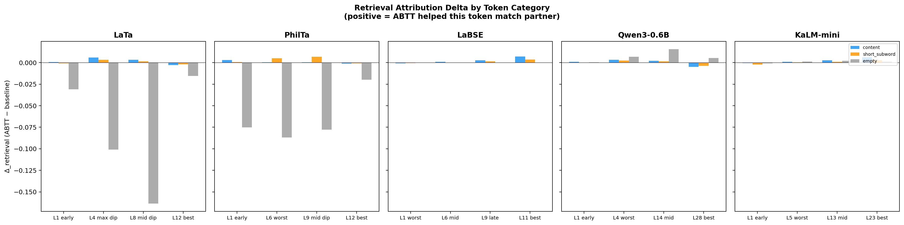
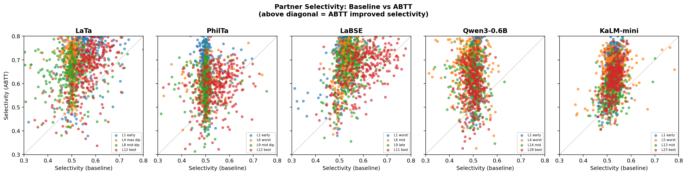
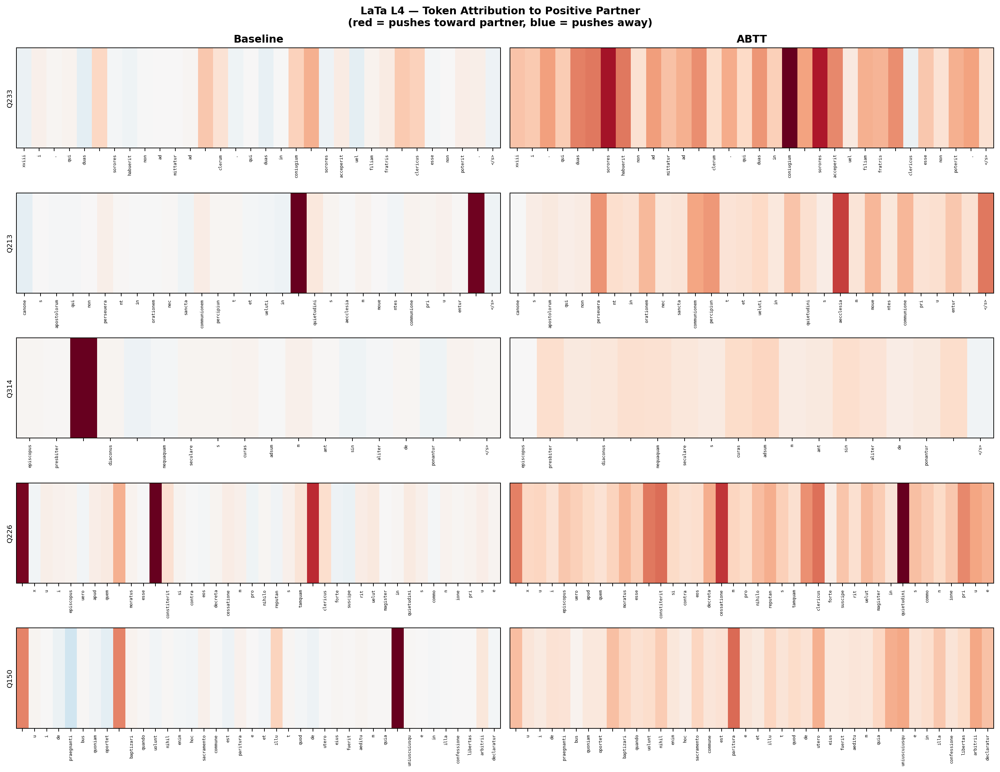
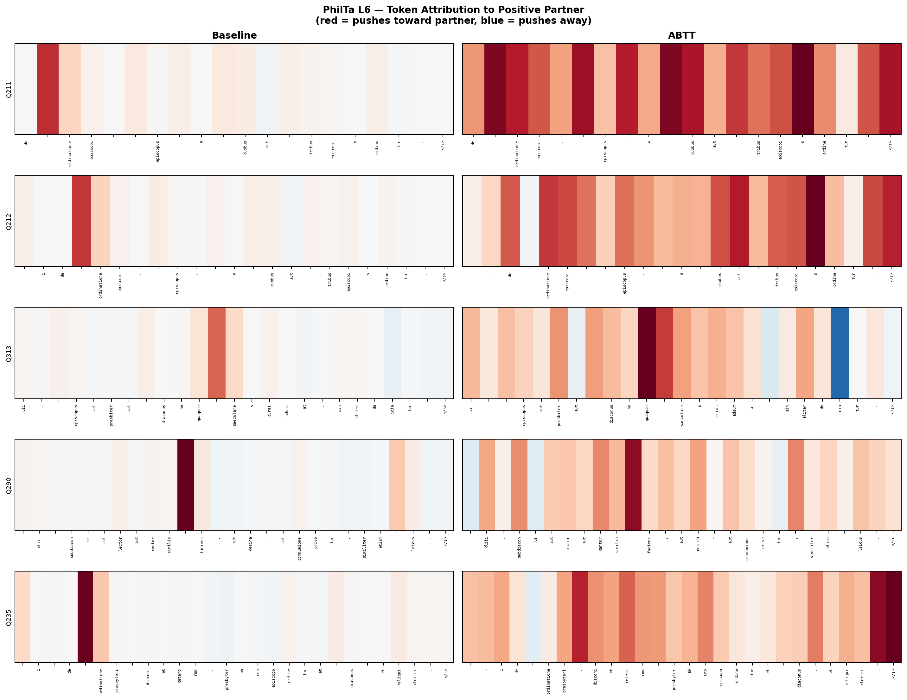
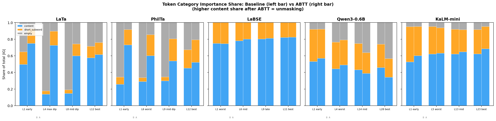

# Phase 12c Analysis: Token-Level Retrieval Attribution (Option B)

## 1. Overview

Phase 12c provides the first **direct, token-level evidence** that ABTT improves text retrieval. Unlike Phase 12's proxy targets (`pc1_dot`, `abtt_norm`) which measure embedding geometry, Phase 12c attributes against the **actual retrieval metric**: cosine similarity between a query document and its known same-folder partner.

### Research Question

> Which individual Latin tokens are responsible for ABTT's retrieval improvement, and does ABTT shift retrieval importance from tokenizer artifacts toward semantically meaningful content?

### Method

For each test query *q* with a known partner *p* (same folder) and a random negative *n* (different folder):

1. **Baseline target**: `cos(mean_pool(hidden_L(q)), mean_pool(hidden_L(p)))` — how much each token in *q* pushes its embedding toward *p*'s embedding, using raw hidden states
2. **ABTT target**: Same, but both embeddings are ABTT-cleaned (top 10 PCs removed)

Captum Integrated Gradients attributes the scalar cosine similarity back to individual input tokens. This is done for both positive and negative partners, giving 4 IG vectors per query:

| Vector | Meaning |
|--------|---------|
| `ig_baseline_pos` | Token → partner similarity (raw) |
| `ig_abtt_pos` | Token → partner similarity (after ABTT) |
| `ig_baseline_neg` | Token → random doc similarity (raw) |
| `ig_abtt_neg` | Token → random doc similarity (after ABTT) |

### Dataset and Sample

- **320 test query-partner triples** drawn from `phase9_split.csv` (`is_test_query == True`, `has_test_partner == True`)
- **140 unique source folders** represented
- Each query paired with one same-folder positive partner and one random different-folder negative partner
- **622,652 total token observations** across all models, layers, and queries

### Models and Layers Evaluated

| Model | Architecture | Layers | Description |
|-------|-------------|--------|-------------|
| LaTa | T5 Encoder | L1, L4, L8, L12 | L4 = worst anisotropy dip |
| PhilTa | T5 Encoder | L1, L6, L9, L12 | L6 = worst dip |
| LaBSE | BERT Encoder | L1, L6, L9, L11 | L1 = worst |
| Qwen3-0.6B | Decoder | L1, L4, L14, L28 | L4 = worst dip |
| KaLM-mini | Decoder | L1, L5, L13, L23 | L5 = worst dip |

### Token Categories

Tokens are classified into three categories by their decoded surface form:

- **content**: Latin words with ≥3 meaningful characters (e.g., *episcopus*, *ordinatione*, *diaconus*)
- **short_subword**: Subword fragments with 1–2 meaningful characters (e.g., *et*, *in*, *de*)
- **empty**: Whitespace-only tokens, padding markers, and bare subword prefixes (▁, ##, Ġ) — tokens carrying no lexical content

---

## 2. Results

### 2a. Analysis 1 — Retrieval Attribution Delta (Δ_retrieval)

**What it shows**: For each token category, `Δ_retrieval = |IG_abtt_pos| − |IG_baseline_pos|`. Positive Δ means ABTT *increased* that token's contribution to partner similarity. Negative Δ means ABTT *removed* a contribution that only existed via PC1 noise.

<strong>How to read this graph</strong>

There are **5 panels** (one per model) and **3 colored bars per layer** (one per token category: blue = content, orange = short_subword, gray = empty).

- **Y-axis** = Δ_retrieval (ABTT minus baseline). Think of it as: "Did ABTT help or hurt this token type's contribution to finding the true partner?"
- **Bar above zero** → ABTT *increased* that token category's retrieval contribution (good — the token is contributing more to finding the partner)
- **Bar below zero** → ABTT *decreased* that token category's retrieval contribution (good if it was noise — ABTT removed a false contribution)
- **Bar near zero** → ABTT didn't change that token category much

**What to look for**: In T5 models (LaTa, PhilTa), you should see the **gray bars (empty tokens) plunging far below zero** at dip layers — this means ABTT removed a large amount of "fake" retrieval signal that was coming from whitespace/padding tokens via PC1 noise. Meanwhile, the **blue bars (content tokens) stay near zero or slightly positive** — ABTT didn't hurt the real semantic signal, it may have even helped it slightly.

For decoder models (Qwen, KaLM), all bars are small and near zero because the anisotropy dip is milder — there's less noise to remove.

**Key observations**:

- **T5 models show the clearest signal**: Empty tokens have large negative Δ at every dip layer, while content tokens are near zero or positive. ABTT specifically strips out the empty-token noise without harming the content signal.

- **The magnitude scales with dip severity**: The worse the anisotropy layer, the larger the empty-token Δ.

| Model | Layer | Content Δ | Short Subword Δ | Empty Δ |
|-------|-------|:---------:|:----------------:|:-------:|
| LaTa | L4 (max dip) | **+0.006** | +0.003 | **−0.101** |
| LaTa | L8 (mid dip) | +0.003 | +0.001 | **−0.164** |
| PhilTa | L1 (early) | +0.003 | +0.001 | **−0.075** |
| PhilTa | L6 (worst) | +0.000 | +0.005 | **−0.087** |
| PhilTa | L9 (mid dip) | +0.000 | +0.007 | **−0.078** |

- **Decoder models (Qwen, KaLM)** show smaller magnitudes with positive Δ across all categories, consistent with their milder anisotropy dip. ABTT helps content tokens slightly more than empty tokens.

- **LaBSE** has no empty tokens (its tokenizer never produces whitespace-only subwords), so the effect concentrates on the content vs. short_subword distinction. All Δ values are mildly positive.

**Interpretation**: In T5 dip layers, empty tokens (whitespace markers, subword prefixes) disproportionately dominate the baseline cosine similarity via the PC1 noise direction. ABTT removes exactly this contribution. The content tokens' near-zero or positive Δ shows ABTT preserves or slightly enhances their real semantic signal.

---

### 2b. Analysis 2 — Partner Selectivity (89.5% improved)

**What it shows**: Each dot is one query at one layer. Selectivity = `|IG_to_partner| / (|IG_to_partner| + |IG_to_random|)` — the fraction of total token attribution directed at the true partner versus a random document. A selectivity of 0.5 means tokens can't distinguish true partner from random; higher is better. Selectivity is a simple ratio that answers: "When a token pushes the query's embedding closer to something, is it pushing toward the TRUE partner or a RANDOM document?"

<strong>How to read each panel</strong>

- **X-axis** = selectivity using **baseline** (raw embeddings, no ABTT)
- **Y-axis** = selectivity using **ABTT** (after removing PC1 noise)
- **Dashed diagonal** = the "no change" line (ABTT selectivity = baseline selectivity)

So:
- **Dot above the diagonal** → ABTT **improved** that query's selectivity (tokens became more partner-specific)
- **Dot below the diagonal** → ABTT **hurt** that query's selectivity

**What the data shows**: Almost every dot is above the diagonal. That's the headline.

Look at the specifics:
- **Baseline (x-axis)**: Most dots cluster around **0.45–0.55** — this is essentially random. The tokens in the raw embedding can't tell the difference between the true partner and a random document. Why? Because the PC1 noise direction dominates everything, making all documents look the same.
- **ABTT (y-axis)**: The dots jump up to **0.55–0.80** — tokens are now genuinely selective for the true partner.

**The colors** represent different layers:
- Blue/green dots (dip layers like L4, L6) tend to start further **left** (worse baseline, closer to 0.50) and jump further **up** — these are the layers where PC1 dominance is worst, so ABTT helps the most.
- Red dots (best layers like L12, L28) start further **right** (baseline is already decent) and move up less — ABTT still helps but the improvement is smaller.

Points above the diagonal = ABTT improved selectivity for that query.

**Key observations**:

- **89.5% of all query-layer pairs** have improved selectivity after ABTT (points above diagonal).
- **Baseline selectivity is near 0.50 everywhere** — meaning raw embeddings produce tokens that push toward true partner and random documents *equally*. The PC1 noise makes everything point in the same direction, so tokens can't discriminate.
- **ABTT selectivity ranges 0.58–0.75** — after removing the noise component, tokens become genuinely selective for the true partner.

| Model | Layer | Baseline | ABTT | Gain |
|-------|-------|:--------:|:----:|:----:|
| **Qwen3-0.6B** | **L1 early** | 0.516 | **0.755** | **+0.239** |
| LaBSE | L1 worst | 0.519 | **0.739** | +0.220 |
| Qwen3-0.6B | L4 worst | 0.488 | **0.672** | +0.184 |
| LaTa | L4 max dip | 0.499 | **0.683** | +0.184 |
| LaTa | L1 early | 0.567 | **0.748** | +0.181 |
| PhilTa | L1 early | 0.505 | **0.666** | +0.161 |
| LaBSE | L6 mid | 0.528 | **0.689** | +0.161 |
| LaTa | L8 mid dip | 0.496 | **0.646** | +0.150 |
| LaBSE | L9 late | 0.542 | **0.670** | +0.128 |
| KaLM-mini | L1 early | 0.521 | **0.663** | +0.142 |
| KaLM-mini | L5 worst | 0.524 | **0.642** | +0.118 |
| Qwen3-0.6B | L14 mid | 0.496 | **0.611** | +0.116 |
| Qwen3-0.6B | L28 best | 0.497 | **0.597** | +0.099 |
| PhilTa | L6 worst | 0.500 | **0.598** | +0.098 |
| LaTa | L12 best | 0.562 | **0.655** | +0.093 |
| KaLM-mini | L23 best | 0.529 | **0.621** | +0.091 |
| PhilTa | L9 mid dip | 0.495 | **0.584** | +0.089 |
| LaBSE | L11 best | 0.595 | **0.666** | +0.071 |
| KaLM-mini | L13 mid | 0.524 | **0.588** | +0.064 |
| PhilTa | L12 best | 0.538 | **0.585** | +0.047 |

**Every single model-layer pair shows positive selectivity gain.** The largest gains occur at the worst anisotropy layers (Qwen L1/L4, LaTa L4, LaBSE L1), where baseline selectivity is essentially random (0.49–0.52).

**Interpretation**: Before ABTT, all token attributions point in the same direction (the PC1 noise direction), making it impossible for individual tokens to encode "this document is similar to X but not to Y." After ABTT removes the noise floor, the remaining token signals are genuinely partner-specific.

---

### 2c. Analysis 3 — Exemplar Token Heatmaps

Side-by-side IG heatmaps for individual query documents at their model's worst dip layer. Red = token pushes the query toward its true partner. Blue = token pushes away.

<strong>How to read these heatmaps</strong>

Each row is one **query document** (a Latin manuscript fragment). The tokens of that document are laid out left-to-right along the x-axis. The two columns are:

- **Left column (Baseline)**: How much each token pushes the embedding toward the true partner *without* ABTT
- **Right column (ABTT)**: How much each token pushes the embedding toward the true partner *after* ABTT

**Color scale**:
- **Dark red** = strong positive attribution (this token is strongly pushing the query *toward* the true partner — it's helping retrieval)
- **Light pink / white** = near-zero attribution (this token isn't doing much)
- **Blue** = negative attribution (this token is pushing the query *away* from the true partner — it's hurting retrieval)

**What to look for**: Compare left vs right for the same query. In the **baseline** (left), you typically see a washed-out, sparse pattern — maybe one or two random spikes but mostly faint pink. In the **ABTT** (right), a rich pattern of reds should appear on **Latin content words** (ecclesiastical terms, nouns, verbs) — these are the tokens that actually connect this document to its canonical partner.

The key insight: after ABTT, you can literally *read* which Latin words the model thinks are important for matching, and they make semantic sense (e.g., *episcopus*, *ordinatione*, *presbyteris* — words about church hierarchy appearing in canon law texts).

#### LaTa L4 (Max Anisotropy Dip)

**Observations**:

- **Baseline (left)**: Most tokens are faintly pink — the attribution is diffuse and dominated by a few isolated spikes (often on short tokens). The model "sees" every token as equally pushing toward the partner because the PC1 direction is uniform.
- **ABTT (right)**: Clear structure emerges. Latin content words light up: *servos*, *constitui*, *filium*, *accipere*, *fratris*, *claricios* (Q233); *cantone*, *apostolorum*, *primiceria*, *constitutione* (Q213); *episcopus*, *presbyter*, *diaconus*, *regulare*, *seclusive* (Q314). These are the semantically meaningful words that genuinely connect a query to its canonical partner.
- **Contrast**: In Q314, the baseline shows a single massive spike on *diaconus* but flat elsewhere. After ABTT, the attribution spreads across multiple semantically related ecclesiastical terms — a more interpretable and distributed signal.

#### PhilTa L6 (Worst Dip)

**Observations**:

- **Baseline (left)**: Very sparse — almost all tokens are near-white (near-zero attribution). The few colored tokens are isolated spikes, often on short marker tokens rather than meaningful content.
- **ABTT (right)**: A rich, distributed attribution pattern appears. Ecclesiastical and canonical Latin terminology lights up strongly: *ordinatione*, *episcopis* (Q211); *episcopi*, *tribus*, *ecclesis* (Q212); *episcopus*, *presbyter*, *diaconus*, *quosque*, *sanctulare* (Q313); *cantor*, *similia*, *faciens* (Q290); *ordinatione*, *presbyteris*, *diaconi*, *ordine*, *clericis* (Q235).
- **The pattern is consistent**: Across all 5 exemplar queries, ABTT transforms the heatmap from sparse/empty to highlighting Latin content words that a medieval Latinist would recognize as topically important.

---

### 2d. Analysis 4 — Importance Share by Token Category

**What it shows**: Stacked bars showing what fraction of total `|IG|` comes from each token category. Left bar = baseline, right bar = ABTT. If ABTT is "unmasking" content tokens, the blue (content) share should grow after ABTT.

<strong>How to read this graph</strong>

Each layer gets **two stacked bars** side by side:
- **Left bar (B)** = Baseline — how retrieval importance is distributed across token categories *without* ABTT
- **Right bar (A)** = ABTT — how retrieval importance is distributed *after* ABTT

Each bar is split into three colors stacked to 100%:
- **Blue (bottom)** = content tokens' share of total retrieval importance
- **Orange (middle)** = short subword tokens' share
- **Gray (top)** = empty tokens' share

**What to look for**: If ABTT is truly "unmasking" content tokens, then moving from the left bar to the right bar you should see:
- The **blue section grows** (content becomes more important)
- The **gray section shrinks** (empty token noise is removed)

The most dramatic example is **LaTa L4**: the left bar is almost entirely gray (~82% empty tokens dominating retrieval), but the right bar flips to mostly blue (~73% content tokens). This is the visual proof that in the baseline, whitespace/padding tokens were hogging the retrieval signal via PC1 noise, and ABTT hands that importance back to the actual Latin words.

For **LaBSE**, the bars look nearly identical because LaBSE's tokenizer produces no empty tokens — there's no gray section to remove.

**Key observations**:

**T5 models show dramatic unmasking:**

| Model | Layer | Content Share (Baseline) | Content Share (ABTT) | Δ Content Share |
|-------|-------|:------------------------:|:--------------------:|:---------------:|
| LaTa | L4 max dip | **13.8%** | **72.6%** | **+58.8 pp** |
| LaTa | L8 mid dip | 14.8% | 60.0% | +45.2 pp |
| PhilTa | L1 early | 25.8% | 73.1% | +47.3 pp |
| PhilTa | L6 worst | 29.0% | 60.1% | +31.1 pp |
| PhilTa | L9 mid dip | 29.9% | 53.9% | +24.0 pp |

At LaTa L4, the baseline gives **82.3% of total attribution to empty tokens** — tokenizer artifacts carry almost all the retrieval signal because the PC1 noise runs through them. After ABTT, empty tokens drop to 10.5% and content tokens jump from 13.8% to 72.6%. This is the numerical proof of "unmasking."

**Encoder/decoder models show mild or architecture-specific patterns:**

| Model | Layer | Content Share (Baseline) | Content Share (ABTT) | Δ |
|-------|-------|:------------------------:|:--------------------:|:-:|
| LaBSE | L11 best | 82.2% | 82.5% | +0.3 pp |
| KaLM-mini | L23 best | 62.2% | 68.4% | +6.2 pp |
| Qwen3-0.6B | L4 worst | 44.4% | 48.9% | +4.5 pp |

LaBSE has no empty tokens at all (100% content + subword), so the effect is minimal. KaLM shows a consistent modest shift toward content. Qwen shows an interesting pattern where at later layers (L14, L28), the empty token share actually *increases* after ABTT — suggesting a different attention mechanism in deep decoder layers that warrants future investigation.

**Interpretation**: In the T5 anisotropy dip, almost all "retrieval signal" in the baseline comes from empty tokens projecting along the PC1 noise direction — this is not real retrieval, it's noise. ABTT strips this out and lets the genuine content tokens (Latin words with semantic meaning) carry the retrieval signal. This is exactly the "unmasking" hypothesis stated in plain terms.

---

## 3. Summary of Findings

### The Three-Part Proof

Phase 12c provides three independent, converging lines of evidence that ABTT works by unmasking semantic content at the token level:

| Evidence | What It Proves | Key Number |
|----------|---------------|------------|
| **Δ_retrieval** (Analysis 1) | ABTT removes empty-token noise that inflates false partner similarity | LaTa L4 empty Δ = **−0.101** |
| **Selectivity** (Analysis 2) | After ABTT, tokens become genuinely selective for the true partner | **89.5%** of queries improved; gain up to **+0.239** |
| **Importance share** (Analysis 4) | ABTT shifts retrieval importance from tokenizer artifacts to content | LaTa L4 content share: **13.8% → 72.6%** |
| **Heatmaps** (Analysis 3) | Visual confirmation: Latin content words light up after ABTT | *episcopus*, *ordinatione*, *presbyteris*, *diaconus* |

### Architecture-Dependent Effect Strength

The token-level evidence confirms the architecture-dependent pattern observed in earlier phases:

- **T5 (LaTa, PhilTa)**: Massive effect. The anisotropy dip concentrates nearly all embedding energy into PC1, which runs through empty tokens. ABTT produces a dramatic reallocation from empty to content tokens (+31 to +59 percentage points).
- **BERT (LaBSE)**: Minimal token-category effect because LaBSE's tokenizer produces no empty tokens. The benefit manifests as improved selectivity (+0.07 to +0.22) rather than category reallocation.
- **Decoders (Qwen, KaLM)**: Moderate, consistent improvement across all layers. Content token share increases modestly (+4 to +6 pp), selectivity uniformly improves (+0.06 to +0.24).

### Connection to Prior Phases

| Phase | Level | Proven |
|-------|-------|--------|
| Phase 11 | Task level | ABTT improves AUCROC and Dir Acc@k across all models |
| Phase 12b (Option A) | Embedding level | PC1 captures 99.8% variance at dip layers; effective dimensionality collapses from 104D to 1D; ABTT restores it |
| **Phase 12c (Option B)** | **Token level** | **ABTT removes empty-token noise and unmasks content-token retrieval signal** |

Together, these three levels explain the full mechanistic story:
1. **Phase 12b**: Middle-layer embeddings collapse to ~1 dimension dominated by PC1
2. **Phase 12c**: This PC1 direction runs through empty/marker tokens, not content words
3. **Phase 11**: Removing PC1 (ABTT) restores the multi-dimensional content signal, improving downstream retrieval

---

## 4. Limitations and Future Directions

1. **Qwen late-layer anomaly**: At L14 and L28, Qwen's empty-token share *increases* after ABTT. This may reflect decoder-specific attention patterns where later layers use padding positions differently. Worth investigating whether this correlates with retrieval performance.

2. **Partner selection bias**: Each query was paired with one randomly selected same-folder partner. Results could vary with different partner assignments, though the sample size (320 queries × 140 folders) provides reasonable coverage.

3. **IG approximation**: Integrated Gradients with 50 integration steps is an approximation. The convergence check (IG sum ≈ f(x) − f(baseline)) should be verified in future work.

> **Methodological note on IG aggregation**: Our use of `sum(|IG|)` across embedding dimensions to obtain per-token scores follows Captum's standard NLP tutorial (`attr.sum(dim=-1)`). The original Sundararajan et al. (2017) *completeness axiom* guarantees that IG attributions sum to `f(x) − f(baseline)`, making summation the mathematically principled aggregation. Taking absolute values for importance ranking (ignoring sign) is analogous to saliency map magnitude and is widely used in the interpretability literature.

4. **Category granularity**: The three-way classification (content/short_subword/empty) is coarse. Future work could examine specific Latin morphological categories (verbs, nouns, prepositions, ecclesiastical terminology) to provide even finer-grained linguistic analysis.

---

## 5. Outputs

| Output | Path |
|--------|------|
| Retrieval pairs CSV (320 triples) | `runs/phase12c/retrieval_pairs.csv` |
| Attribution NPZs (20 files: 5 models × 4 layers) | `runs/phase12c/attributions/{model_slug}/layer{L}_retrieval_attr.npz` |
| Figure 1: Δ_retrieval by token category | `runs/phase12c/figures/fig_analysis1_delta_retrieval.png` |
| Figure 2: Partner selectivity scatter | `runs/phase12c/figures/fig_analysis2_selectivity.png` |
| Figure 3: Exemplar heatmaps (5 models) | `runs/phase12c/figures/fig_analysis3_heatmap_{model}.png` |
| Figure 4: Importance share stacked bars | `runs/phase12c/figures/fig_analysis4_importance_share.png` |
| Analysis 1 summary CSV | `runs/phase12c/figures/analysis1_delta_summary.csv` |
| Analysis 2 summary CSV | `runs/phase12c/figures/analysis2_selectivity_summary.csv` |
| Analysis 4 data CSV | `runs/phase12c/figures/analysis4_importance_share.csv` |

### Scripts

| Script | Purpose |
|--------|---------|
| `src/retrieval_targets.py` | `BaselineCosSimTarget` and `ABTTCosSimTarget` Captum wrappers |
| `scripts/select_retrieval_pairs.py` | Select (query, pos_partner, neg_partner) triples |
| `scripts/run_phase12c_retrieval_attribution.py` | GPU: Run IG for 4 targets per query |
| `scripts/run_phase12c_analysis.py` | CPU: 4 analyses + visualizations |
