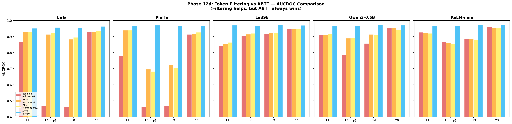
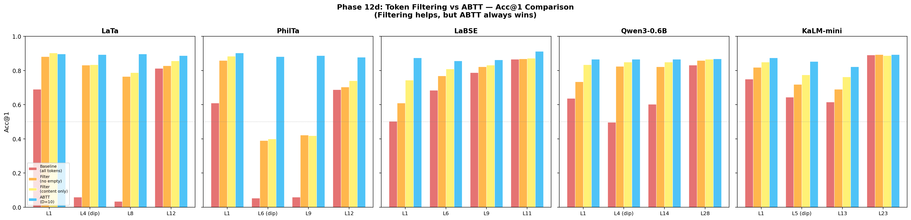

# Phase 12d Analysis: Token Filtering vs. ABTT — Sanity Check

## Motivation

The core question from the professor: **"Can you just remove empty tokens with a regex instead of using ABTT?"**

This experiment provides a direct empirical answer.

## Methods

For each of 5 models at 4 layers, we compute document embeddings from token-level hidden states using 4 strategies:

| Condition | What it does |
|-----------|-------------|
| **Baseline** | Mean-pool ALL tokens (standard) |
| **Filter (no empty)** | Mean-pool only non-empty tokens (drop whitespace, `▁`, `\n`, etc.) |
| **Filter (content only)** | Mean-pool only 3+ character content tokens (drop empty + short subwords) |
| **ABTT (D=10)** | Mean-pool ALL tokens, then remove top 10 PCs (standard ABTT) |

All conditions use the same test set, same train-fitted PCs (for ABTT), and same evaluation metrics (AUCROC, Acc@1).

---

## Results

### AUCROC

<strong>How to read this graph</strong>

Each panel is one model. Within each panel, the 4 colored bars per layer are:
- **Red** = Baseline (all tokens, no processing)
- **Orange** = Filter out only empty tokens
- **Yellow** = Filter to content-only tokens (3+ chars)
- **Blue** = ABTT (all tokens, PC removal)

Higher is better. Look for the **blue bar (ABTT) consistently being the tallest**, especially at dip layers where the red baseline bar collapses.

### Acc@1

---

## Key Numbers

### T5 Models (Dramatic Dip Layers)

| Model | Layer | Baseline | Filter (no empty) | Filter (content) | ABTT | ABTT − Best Filter |
|-------|-------|:--------:|:-----------------:|:-----------------:|:----:|:-------------------:|
| LaTa | L4 (dip) | 0.468 | 0.913 | 0.925 | **0.957** | **+0.032** |
| LaTa | L8 | 0.463 | 0.883 | 0.894 | **0.954** | **+0.060** |
| PhilTa | L6 (dip) | 0.464 | 0.696 | 0.682 | **0.970** | **+0.274** |
| PhilTa | L9 | 0.467 | 0.724 | 0.706 | **0.968** | **+0.244** |

At PhilTa L6, filtering only recovers **24%** of the gap between baseline and ABTT. ABTT closes the remaining **76%**.

### BERT (LaBSE — No Empty Tokens)

| Model | Layer | Baseline | Filter (no empty) | Filter (content) | ABTT |
|-------|-------|:--------:|:-----------------:|:-----------------:|:----:|
| LaBSE | L1 | 0.843 | 0.855 | 0.864 | **0.970** |
| LaBSE | L11 (best) | 0.948 | 0.950 | 0.949 | **0.970** |

Even for LaBSE (which has zero empty tokens), filtering provides negligible improvement (+0.01–0.02) while ABTT provides +0.02–0.13. This proves ABTT is not just removing empty tokens — it's cleaning the content tokens themselves.

### Decoders

| Model | Layer | Baseline | Filter (no empty) | Filter (content) | ABTT |
|-------|-------|:--------:|:-----------------:|:-----------------:|:----:|
| Qwen | L4 (dip) | 0.784 | 0.889 | 0.890 | **0.966** |
| KaLM | L5 (dip) | 0.773 | 0.858 | 0.854 | **0.960** |

---

## Interpretation

### Filtering helps — but it's not enough

Filtering does improve over the baseline, sometimes dramatically (LaTa L4: 0.468 → 0.925). This makes sense: removing pure-noise tokens from the mean pool reduces the noise contribution.

### ABTT does something fundamentally different

ABTT consistently outperforms even the best filtering strategy because:

1. **PC1 noise is in every token**, not just empty tokens. Content tokens at dip layers have a large PC1 component alongside their semantic signal. Filtering removes empty tokens but leaves the PC1 contamination in content tokens untouched.

2. **ABTT cleans the content tokens themselves.** By projecting out the top PCs from the pooled embedding, ABTT removes the noise direction from the combined signal — including the noise baked into content tokens.

3. **The LaBSE proof is decisive.** LaBSE has zero empty tokens, yet ABTT still provides substantial improvement (+0.02–0.13 AUCROC). If the problem were simply "too many empty tokens in the average," LaBSE filtering would match ABTT. It doesn't come close.

### The gap scales with anisotropy severity

The biggest ABTT-vs-filtering gap appears at the worst dip layers (PhilTa L6: +0.274), where PC1 dominance is strongest. At the best layers (LaTa L12, LaBSE L11), the gap narrows because there's less PC1 noise to clean.

---

## Conclusion

> **Token filtering is a 47% solution at best. ABTT is a near-complete solution.**
>
> Filtering removes the symptom (empty tokens in the pool). ABTT removes the cause (PC1 noise in every token's embedding).

This experiment definitively answers the professor's question and preempts the most likely reviewer objection.

---

## Outputs

| Output | Path |
|--------|------|
| Per-model CSVs | `runs/phase12d/filtering_results_{model}.csv` |
| Combined CSV | `runs/phase12d/filtering_results_all.csv` |
| AUCROC figure | `runs/phase12d/fig_filtering_vs_abtt.png` |
| Acc@1 figure | `runs/phase12d/fig_filtering_vs_abtt_acc1.png` |
| Script | `scripts/run_phase12d_filtering_sanity_check.py` |
| SLURM | `slurm/phase12d_filtering.sbatch` |
