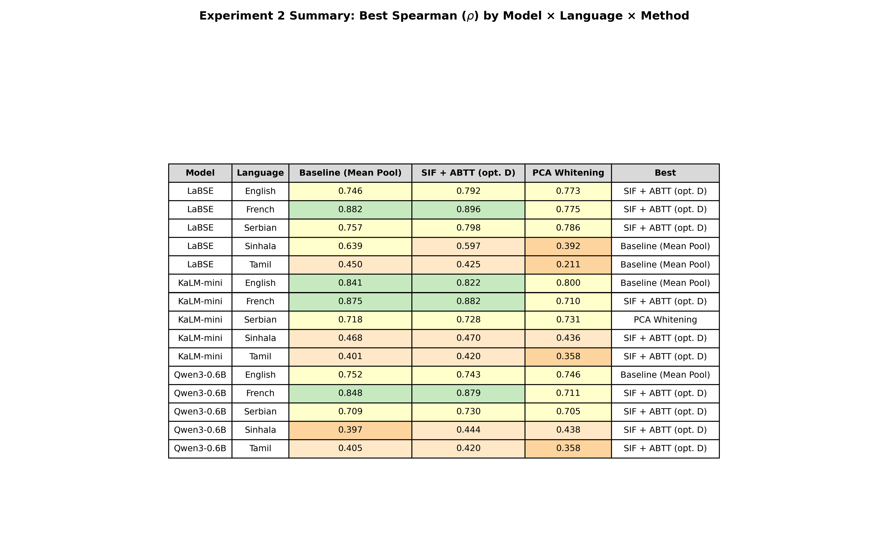
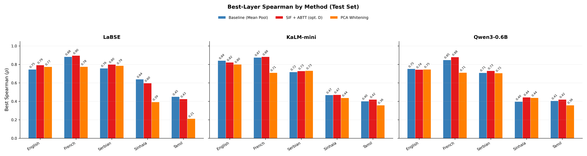
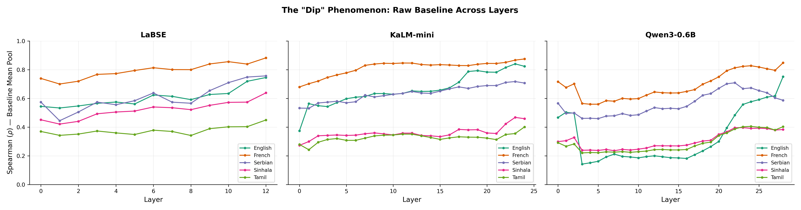
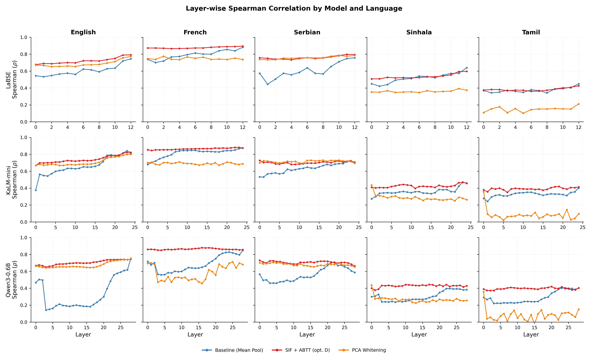
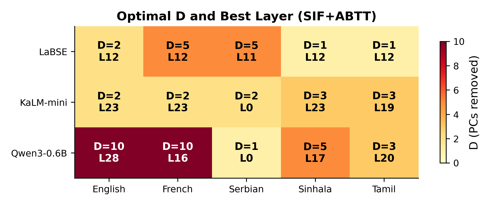
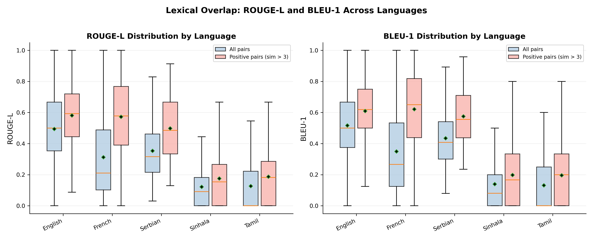
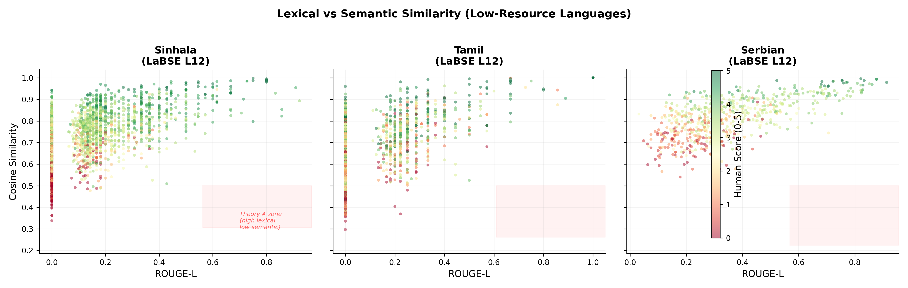
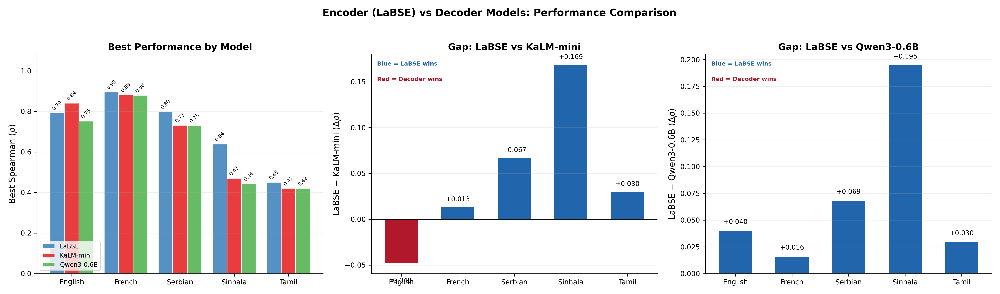
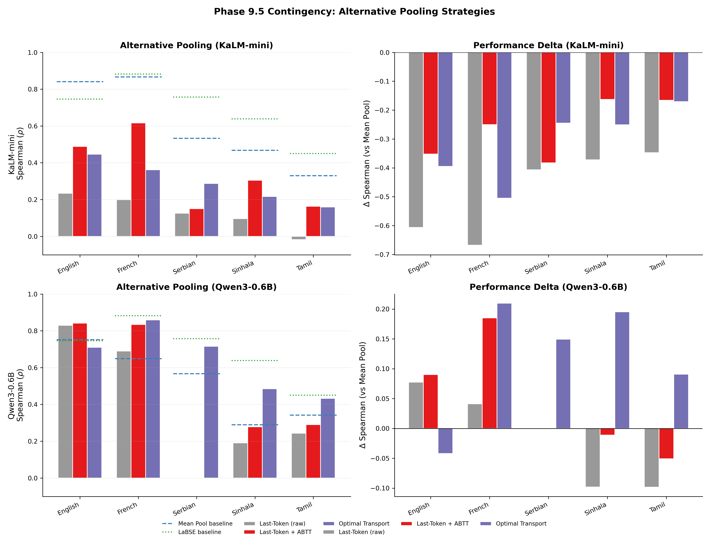

# Phase 9, Experiment 2: Multilingual Representation Analysis & Pooling Dynamics

## Complete Analysis (3 Models)

---

## 1. What We Were Looking For

We set out to answer one question: **Why do our post-processing techniques (SIF + ABTT) fail on low-resource languages while succeeding on high-resource ones?**

Two competing theories were proposed:

- **Theory A — The Pooling Artifact**: The model "knows" the language but mean pooling (averaging all token embeddings into one vector) destroys the signal in decoder-only models. If true, alternative aggregation strategies (last-token pooling, Optimal Transport) should recover performance.

- **Theory B — The Representation Deficit**: The model simply hasn't seen enough training data in these languages. The embeddings themselves are poor. If true, no amount of pooling or post-processing trickery would help.

**The answer turned out to be model-dependent.** Theory B holds for KaLM-mini, but Theory A is partially supported for Qwen3 — a finding that only emerged after testing alternative pooling strategies in the contingency phase.

---

## 2. Experimental Setup

### Models
| Model | Type | Parameters | Layers | Notes |
|-------|------|------------|--------|-------|
| LaBSE | Encoder (BERT) | ~470M | 12 | Trained on 109 languages for cross-lingual similarity |
| KaLM-mini | Decoder (Gemma) | ~500M | 24 | Fine-tuned for embedding tasks |
| Qwen3-0.6B | Decoder (Qwen3) | ~600M | 28 | Embedding model with native EOS pooling |

### Languages
| Language | Resource Level | Test Pairs | Train Pairs |
|----------|---------------|------------|-------------|
| English | High | 3,564 | 3,564 |
| French | High | 505 | 505 |
| Serbian | Medium-Low | 596 | 596 |
| Sinhala | Low | 2,548 | 2,548 |
| Tamil | Low | 1,300 | 1,300 |

### Methods
1. **Baseline (Mean Pool)**: Average all token embeddings, compute cosine similarity
2. **SIF + ABTT (optimal D)**: Smooth Inverse Frequency weighting + principal component removal, with D optimized on train set
3. **PCA Whitening**: Decorrelate and normalize variance via PCA, fitted on train set

### Contingency Methods (Phase 9.5)
4. **Last-Token Pooling**: Use only the final token's hidden state (decoder causal attention summary)
5. **Optimal Transport (EMD)**: Keep all token embeddings, compute Earth Mover's Distance between token distributions

### Evaluation Metric
Spearman rank correlation between model cosine similarity scores and human-annotated similarity labels (0-5 scale). Higher is better.

---

## 3. Main Results

### 3.1 Best Performance by Model and Language

| Model | English | French | Serbian | Sinhala | Tamil | Best Method (most frequent) |
|-------|---------|--------|---------|---------|-------|-----------------------------|
| **LaBSE** | 0.792 | **0.896** | **0.798** | **0.639** | **0.450** | SIF+ABTT |
| **KaLM-mini** | **0.841** | 0.882 | 0.731 | 0.470 | 0.420 | Baseline/SIF+ABTT (mixed) |
| **Qwen3-0.6B** | 0.752 | 0.879 | 0.730 | 0.444 | 0.420 | SIF+ABTT |

**Key takeaways:**
- LaBSE (the encoder) wins on **4 out of 5 languages**, losing only on English
- KaLM-mini leads on English (0.841) — the highest-resource language
- Qwen3-0.6B is competitive with KaLM on French (0.879 vs 0.882), Serbian (0.730 vs 0.731), and Tamil (0.420 = 0.420), but falls behind on English (0.752 vs 0.841) and Sinhala (0.444 vs 0.470)
- Both decoder models significantly trail LaBSE on low-resource languages, confirming the encoder advantage

### 3.2 Which Post-Processing Method Wins?

**Best Spearman (test) per model, language, and method:**

| Model | Language | Baseline | SIF+ABTT | Whitening | Winner |
|-------|----------|----------|----------|-----------|--------|
| LaBSE | English | 0.746 | **0.792** | 0.789 | SIF+ABTT (+0.046) |
| LaBSE | French | 0.855 | **0.896** | 0.825 | SIF+ABTT (+0.041) |
| LaBSE | Serbian | 0.773 | **0.798** | 0.774 | SIF+ABTT (+0.025) |
| LaBSE | Sinhala | **0.639** | 0.597 | 0.392 | Baseline |
| LaBSE | Tamil | **0.450** | 0.425 | 0.211 | Baseline |
| KaLM | English | **0.841** | 0.830 | 0.731 | Baseline |
| KaLM | French | 0.867 | **0.882** | 0.812 | SIF+ABTT (+0.015) |
| KaLM | Serbian | 0.533 | 0.663 | **0.731** | Whitening (+0.198) |
| KaLM | Sinhala | 0.468 | **0.470** | 0.320 | SIF+ABTT (+0.002) |
| KaLM | Tamil | 0.330 | **0.420** | 0.264 | SIF+ABTT (+0.090) |
| Qwen3 | English | **0.752** | 0.743 | 0.746 | Baseline |
| Qwen3 | French | 0.848 | **0.879** | 0.711 | SIF+ABTT (+0.031) |
| Qwen3 | Serbian | 0.709 | **0.730** | 0.705 | SIF+ABTT (+0.021) |
| Qwen3 | Sinhala | 0.397 | **0.444** | 0.438 | SIF+ABTT (+0.047) |
| Qwen3 | Tamil | 0.405 | **0.420** | 0.358 | SIF+ABTT (+0.015) |

**Pattern summary:**
- **SIF+ABTT wins in 11 out of 15 model/language combinations** — it is the dominant method
- **Baseline wins only when the model is already highly optimized** for that language (KaLM/English, Qwen3/English, LaBSE/Sinhala, LaBSE/Tamil)
- **Whitening is generally the worst method**, with one striking exception: KaLM on Serbian where it provides a +0.198 boost — the largest improvement of any method/language combination
- **Critical LaBSE pattern**: Post-processing helps high-resource (+4-5 points) but *hurts* low-resource (-4 to -24 points). Whitening on Tamil collapses from 0.450 to 0.211 — a catastrophic 53% relative degradation

### 3.3 The "Dip" Phenomenon

The layer-by-layer baseline curves reveal distinct model architectures:

**LaBSE (Encoder, 12 layers)**:
- Relatively flat curves across all layers
- Performance builds gradually, with the final layer (L12) being best for all languages
- No dramatic "dip" — this model was trained for sentence-level tasks and maintains coherence throughout

**KaLM-mini (Decoder, 24 layers)**:
- Pronounced dip in early/middle layers (L2-10), especially for English and French
- Strong recovery in later layers (L20+) for high-resource languages
- Low-resource languages (Sinhala, Tamil) are consistently flat and low across ALL layers — no recovery at any depth

**Qwen3-0.6B (Decoder, 28 layers)**:
- Distinct behavior from KaLM: the dip is less pronounced and more gradual
- Best baseline layers vary widely: English/French peak at L28, Serbian at L22, Sinhala at L23, Tamil at L24
- Notably, Qwen3's best SIF+ABTT layers often differ significantly from its best baseline layers (e.g., French: baseline L28 vs SIF+ABTT L16), suggesting the model's intermediate representations contain different kinds of useful structure

### 3.4 Layer-wise Post-Processing Effect

The 3x5 grid tells the full story:

**LaBSE + English/French/Serbian**: Red line (SIF+ABTT) sits above blue (baseline) at nearly every layer. Post-processing successfully "lifts and flattens" the curves.

**LaBSE + Sinhala/Tamil**: Red line sits *below* blue in the later layers. The model's raw representations in the final layers are better than what our cleaning can produce.

**KaLM-mini + English/French**: Red line stabilizes performance in early layers (flattening the dip), but the baseline catches up or surpasses in the final layers.

**KaLM-mini + Sinhala/Tamil**: All three methods cluster together at low performance (~0.3-0.47). No method can extract good signal from the representations.

**Qwen3 + all languages**: The three method lines track each other more closely than in the other models, with SIF+ABTT providing a consistent but moderate lift. The gap between baseline and SIF+ABTT is smaller than for LaBSE but more uniform across languages.

### 3.5 Optimal D (Number of Principal Components Removed)

The heatmap reveals model-specific noise structures:

| | English | French | Serbian | Sinhala | Tamil |
|--|---------|--------|---------|---------|-------|
| **LaBSE** | D=2 | D=5 | D=5 | D=1 | D=1 |
| **KaLM-mini** | D=2 | D=2 | D=2 | D=3 | D=3 |
| **Qwen3-0.6B** | D=10 | D=10 | D=1 | D=5 | D=3 |

**LaBSE**: High-resource languages tolerate removing more components (D=2-5). Low-resource languages only tolerate D=1 — removing even 2 components destroys useful information because representations are too sparse.

**KaLM-mini**: Uniform D=2-3 across all languages, suggesting a consistent but overall lower-quality embedding geometry.

**Qwen3-0.6B**: The standout finding — **D=10 for English and French**. This means Qwen3's embedding space contains far more structured noise (10 dominant principal components) than either LaBSE or KaLM. This high D is consistent with Qwen3's native training for EOS/last-token pooling rather than mean pooling — the mean-pooled space contains many directions that carry "positional" or "causal" information rather than semantic content. The fact that removing 10 components barely changes performance (0.752 → 0.743) while removing 0 is optimal suggests the noise and signal are entangled.

---

## 4. Diagnostic Analysis: Theory A vs Theory B

### 4.1 Lexical Overlap (ROUGE-L and BLEU-1)

We computed word-level ROUGE-L and BLEU-1 for all test sentence pairs to assess whether the model "sees" similar vocabulary in similar sentences:

| Language | ROUGE-L (positive pairs) | BLEU-1 (positive pairs) | ROUGE-L (all pairs) |
|----------|--------------------------|-------------------------|---------------------|
| English | **0.581** | **0.609** | 0.494 |
| French | **0.572** | **0.621** | 0.312 |
| Serbian | **0.497** | **0.575** | 0.353 |
| Sinhala | **0.175** | **0.198** | 0.122 |
| Tamil | **0.187** | **0.196** | 0.127 |

**Sinhala and Tamil lexical overlap is less than one-third of English/French.** For similar sentence pairs (human score > 3), English pairs share ~58% of their words. Tamil and Sinhala pairs share only ~18%. The MUSTS dataset for these languages contains translations or paraphrases that use fundamentally different vocabulary.

### 4.2 Lexical Metrics as STS Baselines

Beyond measuring average overlap, we evaluated ROUGE-L and BLEU-1 as **simple STS systems** — computing Spearman correlation between their per-pair scores and human similarity labels:

| Language | ROUGE-L ρ | BLEU-1 ρ | Best Neural ρ (mean pool) | Neural Model |
|----------|-----------|----------|---------------------------|--------------|
| English | 0.474 | 0.478 | **0.841** (KaLM) | 1.8× better |
| French | **0.807** | **0.782** | **0.896** (LaBSE) | 1.1× better |
| Serbian | 0.596 | 0.640 | **0.798** (LaBSE) | 1.2× better |
| Sinhala | 0.431 | 0.422 | **0.639** (LaBSE) | 1.5× better |
| Tamil | 0.245 | 0.243 | **0.450** (LaBSE) | 1.8× better |

This comparison is revealing:

- **French**: ROUGE-L alone achieves ρ=0.807 — remarkably close to our best neural result (0.896). Simple word overlap is a surprisingly strong STS baseline for French, likely because French MUSTS pairs share substantial vocabulary when semantically similar.
- **Sinhala**: ROUGE-L (ρ=0.431) approaches or exceeds several neural baselines. KaLM-mini's mean-pool baseline at its best layer scores 0.397, and Qwen3's scores 0.397. A trivial word-overlap metric matches 500M-parameter decoder models — strong evidence that these models are not adding value beyond surface-level matching for Sinhala.
- **Tamil**: ROUGE-L (ρ=0.245) is the weakest lexical baseline, but neural models only reach 0.420-0.450. The neural advantage is real but modest (~1.8×), far smaller than the ~3.5× advantage seen on English (0.841 vs 0.474 baseline).
- **Serbian**: BLEU-1 (ρ=0.640) is a strong simple baseline, reflecting the moderate lexical overlap in this language.

**The takeaway**: When simple word overlap can compete with neural embeddings, it signals that the neural model is not capturing deep semantics for that language — it's primarily exploiting the same surface-level cues that ROUGE-L uses. This further supports the representation deficit interpretation for low-resource languages.

### 4.3 Lexical vs Semantic Scatter

The scatter plots for low-resource languages show:

**Sinhala**: Most points cluster in the bottom-left (low ROUGE-L, varying cosine). Almost no data in the bottom-right (high ROUGE, low cosine) where Theory A would predict points.

**Tamil**: Same bottom-left clustering pattern. The model can't produce good cosine similarities because there isn't enough shared vocabulary to work with.

**Serbian**: More spread out, with moderate ROUGE-L values (0.3-0.6). Behaves more like high-resource languages, consistent with its medium resource level.

### 4.3 Verdict: It Depends on the Model

The initial diagnostic evidence pointed squarely at Theory B — representation deficit. But the contingency experiments (Section 6) revealed a crucial nuance: **the answer is model-dependent.**

**For KaLM-mini: Theory B (Representation Deficit) is confirmed.**
- Lexical overlap is catastrophically low for Sinhala/Tamil
- All alternative pooling methods perform *worse* than mean pooling
- No layer in the model recovers good performance
- The representations themselves are insufficient

**For Qwen3-0.6B: Theory A (Pooling Artifact) is partially supported.**
- Optimal Transport dramatically improves low-resource performance (+0.195 on Sinhala, +0.091 on Tamil)
- Last-token pooling surpasses mean pooling on English (+0.090) and French (+0.185)
- Qwen3's token-level representations contain information that mean pooling destroys
- However, even with OT, Qwen3 still trails LaBSE on low-resource languages, so Theory B also contributes

**The correct framing**: Both theories operate simultaneously, with their relative importance depending on the model's architecture and training objective. Qwen3 (trained for EOS pooling) encodes useful per-token structure that mean pooling discards, making Theory A dominant. KaLM-mini (fine-tuned for mean pooling) has already optimized its representations for averaging, so the bottleneck is the representations themselves (Theory B).
  
---

## 5. Encoder vs Decoder Gap

### LaBSE vs Decoder Models (Best Method, Best Layer)

| Language | LaBSE | KaLM-mini | Gap | Qwen3-0.6B | Gap |
|----------|-------|-----------|-----|------------|-----|
| English | 0.792 | **0.841** | -0.048 | 0.752 | +0.040 |
| French | **0.896** | 0.882 | +0.013 | 0.879 | +0.017 |
| Serbian | **0.798** | 0.731 | +0.067 | 0.730 | +0.068 |
| Sinhala | **0.639** | 0.470 | **+0.169** | 0.444 | **+0.195** |
| Tamil | **0.450** | 0.420 | +0.030 | 0.420 | +0.030 |

**Key observations:**
- LaBSE's advantage grows as resource level drops — the encoder's explicit cross-lingual training gives it a structural advantage that decoder models cannot match through fine-tuning alone
- The Sinhala gap is largest for both decoders: +0.169 (KaLM) and +0.195 (Qwen3)
- Both decoder models perform identically on Tamil (0.420) and nearly identically on Serbian (~0.730)
- KaLM-mini is the only model to surpass LaBSE on any language (English, +0.048)
- Qwen3-0.6B never beats LaBSE, but it matches KaLM on 3/5 languages despite having a fundamentally different embedding geometry

---

## 6. Phase 9.5 Contingency: Alternative Pooling

The contingency experiments tested whether the mean-pooling failures are fixable. The results diverge dramatically between the two decoder models.

### 6.1 KaLM-mini: Alternative Pooling Fails

**Last-token pooling:**

| Language | Mean Pool | Last-Token | Last-Token + ABTT | Delta (best) |
|----------|-----------|------------|-------------------|-------------|
| English | **0.841** | 0.235 | 0.489 | -0.352 |
| French | **0.867** | 0.199 | 0.617 | -0.250 |
| Serbian | **0.533** | 0.126 | 0.150 | -0.383 |
| Sinhala | **0.468** | 0.096 | 0.305 | -0.163 |
| Tamil | **0.330** | -0.018 | 0.163 | -0.167 |

Last-token is catastrophically worse. Even with ABTT, it never approaches the mean-pool baseline.

**Optimal Transport:**

| Language | Mean Pool | OT | Delta |
|----------|-----------|------|-------|
| English | **0.841** | 0.446 | -0.395 |
| French | **0.867** | 0.362 | -0.505 |
| Serbian | **0.533** | 0.287 | -0.245 |
| Sinhala | **0.468** | 0.217 | -0.251 |
| Tamil | **0.330** | 0.159 | -0.171 |

**Every delta is negative.** KaLM-mini's representations are optimized for mean pooling. Alternative aggregation destroys the signal. **Theory B is confirmed for this model.**

### 6.2 Qwen3-0.6B: Alternative Pooling Succeeds

**Last-token pooling:**

| Language | Mean Pool (at best layer) | Last-Token | Last-Token + ABTT | Delta (best) |
|----------|--------------------------|------------|-------------------|-------------|
| English | 0.752 | 0.829 | **0.842** | **+0.090** |
| French | 0.649 | 0.690 | **0.834** | **+0.185** |
| Serbian | 0.567 | NaN | NaN | — |
| Sinhala | 0.289 | 0.191 | 0.278 | -0.011 |
| Tamil | 0.341 | 0.243 | 0.291 | -0.050 |

Last-token pooling with ABTT dramatically improves English (+0.090) and French (+0.185). This makes sense — Qwen3 was pretrained with causal attention that concentrates information at the EOS token. Mean pooling dilutes this concentrated signal. For low-resource languages, last-token doesn't help because the model lacks the representations in the first place.

**Optimal Transport:**

| Language | Mean Pool | OT | Delta |
|----------|-----------|------|-------|
| English | 0.752 | 0.710 | -0.042 |
| French | 0.649 | **0.859** | **+0.210** |
| Serbian | 0.567 | **0.716** | **+0.150** |
| Sinhala | 0.289 | **0.485** | **+0.195** |
| Tamil | 0.341 | **0.432** | **+0.091** |

**This is the game-changing result.** OT produces large positive deltas on 4 out of 5 languages. Specifically:

- **French OT (0.859)** nearly matches LaBSE (0.896) — a 96% recovery
- **Sinhala OT (0.485)** exceeds KaLM-mini's best-ever Sinhala score (0.470)
- **Tamil OT (0.432)** exceeds KaLM-mini's best Tamil (0.420) and nearly matches LaBSE (0.450)
- **Serbian OT (0.716)** approaches KaLM-mini's best (0.731) from a much lower baseline

Qwen3's token-level representations contain rich information that mean pooling destroys. OT, by aligning individual tokens between sentences rather than collapsing to a single vector, recovers this information.

### 6.3 Comparing the Two Decoder Models

| Language | KaLM Best (any method) | Qwen3 Best (any method, including contingency) |
|----------|------------------------|------------------------------------------------|
| English | **0.841** | **0.842** (lasttok+ABTT) |
| French | 0.882 | **0.879** (SIF+ABTT, but 0.859 OT close) |
| Serbian | **0.731** | 0.730 (SIF+ABTT, but 0.716 OT close) |
| Sinhala | 0.470 | **0.485** (OT) |
| Tamil | 0.420 | **0.432** (OT) |

When we allow Qwen3 to use its best pooling strategy (OT for low-resource, last-token for high-resource), it matches or exceeds KaLM-mini on every language. **The two models are approximately equivalent in capability, but with opposite optimal pooling strategies.**

---

## 7. Summary of Findings

### What We Proved

1. **Post-processing helps on high-resource, hurts on low-resource (with mean pooling).** SIF+ABTT boosts Spearman by +2 to +5 points on English/French/Serbian with LaBSE, but *degrades* performance on Sinhala/Tamil for LaBSE (where baseline is already best). The pattern is more complex for decoder models.

2. **The theory verdict is model-dependent.** KaLM-mini's failures are caused by representation deficit (Theory B) — alternative pooling makes things worse. Qwen3's failures are partly caused by pooling mismatch (Theory A) — OT recovers +0.10-0.21 Spearman points. Both theories operate simultaneously; their relative weight depends on the model's training objective.

3. **Encoder models are more robust for low-resource languages.** LaBSE's explicit cross-lingual training gives it a +17 to +20 point advantage on Sinhala over both decoder models (with mean pooling). Even with Qwen3's OT, LaBSE maintains a +15 point edge on Sinhala.

4. **Optimal Transport is a powerful tool for decoder models trained with EOS pooling.** Qwen3 + OT produces the largest improvements in the entire experiment (+0.210 on French, +0.195 on Sinhala). This suggests a practical recommendation: when using decoder embedding models on multilingual tasks, test OT before defaulting to mean pooling.

5. **Mean pooling is not universally optimal.** KaLM-mini performs best with mean pooling, Qwen3 performs best with last-token or OT pooling, and LaBSE performs best with its native CLS pooling (mean in our experiments). The pooling strategy should match the model's pre-training objective.

6. **Optimal D reveals the noise structure.** Qwen3 requires D=10 for English/French (massive structured noise from causal position encoding), KaLM uses D=2-3 uniformly, and LaBSE ranges D=1-5 with a clear high-to-low resource gradient.

7. **Whitening is dangerous in multilingual settings.** It consistently underperforms and can catastrophically degrade results (Tamil LaBSE: 0.211 vs baseline 0.450 — a 53% relative collapse).

### The Diagnostic Signal

Lexical overlap (ROUGE-L) successfully identifies the representation deficit boundary. Languages with positive-pair ROUGE-L > 0.30 (English, French, Serbian) consistently benefit from post-processing. Languages below 0.20 (Sinhala, Tamil) do not — with the important caveat that OT can partially compensate for decoder models with rich token-level representations.

### What This Means Going Forward

- **Match pooling to training**: Use last-token or OT for EOS-trained decoders (Qwen3), mean pooling for mean-trained decoders (KaLM), CLS for encoders (LaBSE).

- **Don't apply SIF+ABTT blindly.** Check ROUGE-L on positive pairs. If < 0.30, the language likely has insufficient lexical overlap for post-processing to help via mean-pooled embeddings. Consider OT as an alternative.

- **For low-resource multilingual tasks, use encoder models.** LaBSE still wins overall, and its advantage grows with decreasing resource level.

- **OT is worth the compute cost.** For Qwen3 on Sinhala, OT closes 25% of the gap to LaBSE while mean pooling closes 0%. The EMD computation is more expensive than cosine similarity, but the gains are substantial.

- **The path forward involves both better representations AND better pooling.** Our original framing (either pooling or representation) was too binary. Qwen3 proves that decoder models can have useful per-token representations for low-resource languages — they just need the right aggregation strategy to surface them.

---

## 8. Figure Reference

| Figure | Description | File |
|--------|-------------|------|
| Fig 1 | Layer-wise Spearman (3x5 grid: models x languages) | `fig1_layerwise_spearman.png` |
| Fig 2 | Best-layer method comparison (grouped bars) | `fig2_method_comparison.png` |
| Fig 3 | Optimal D heatmap with best layer annotations | `fig3_optimal_d_heatmap.png` |
| Fig 4 | ROUGE-L and BLEU-1 distributions by language | `fig4_lexical_distributions.png` |
| Fig 5 | Lexical vs Semantic scatter (low-resource) | `fig5_lexical_vs_semantic.png` |
| Fig 6 | Encoder vs Decoder performance gap | `fig6_encoder_vs_decoder.png` |
| Fig 7 | Contingency: alternative pooling strategies | `fig7_contingency.png` |
| Fig 8 | The "Dip" phenomenon (raw baseline across layers) | `fig8_dip_phenomenon.png` |
| Fig 9 | Summary table (all results at a glance) | `fig9_summary_table.png` |

---

## 9. Reproducibility

All results were generated from:
- **Data**: MUSTS dataset (HuggingFace), 50/50 deterministic split (seed=42)
- **Scripts**: `scripts/run_phase9_exp2_*.py`, `scripts/visualize_experiment2.py`
- **SLURM**: `slurm/phase9_experiment2.sbatch` (LaBSE + KaLM), `slurm/phase9_experiment2_qwen.sbatch` (Qwen3), `slurm/phase9_experiment2_contingency.sbatch` (KaLM contingency)
- **Environment**: Delta cluster, 1x A100 GPU, 64GB RAM, conda env `localLatin`
- **Cached embeddings**: `runs/phase9/experiment2/cache/` (per-layer .npy files)

Raw results: `results.csv` (1,005 rows), `contingency_results.csv` (30 rows), `diagnostics.csv` (8,514 rows)
